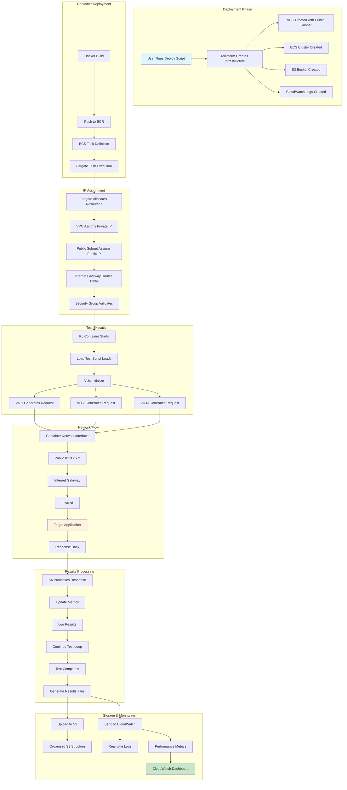
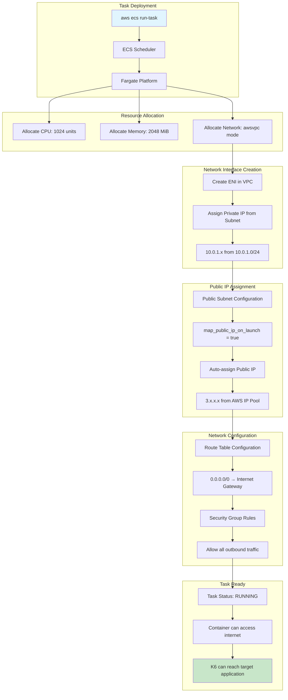
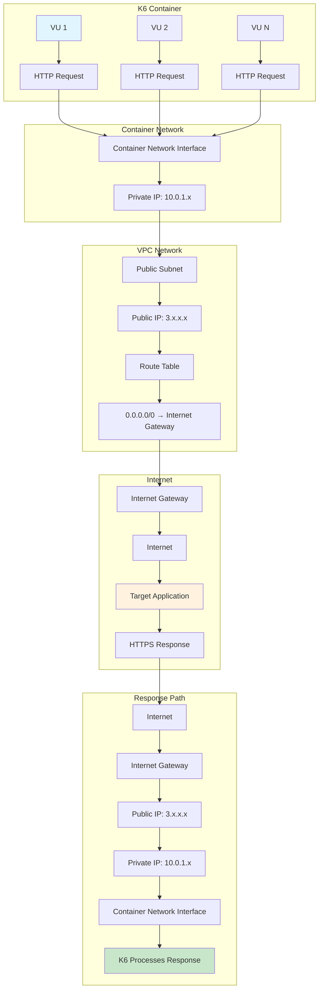
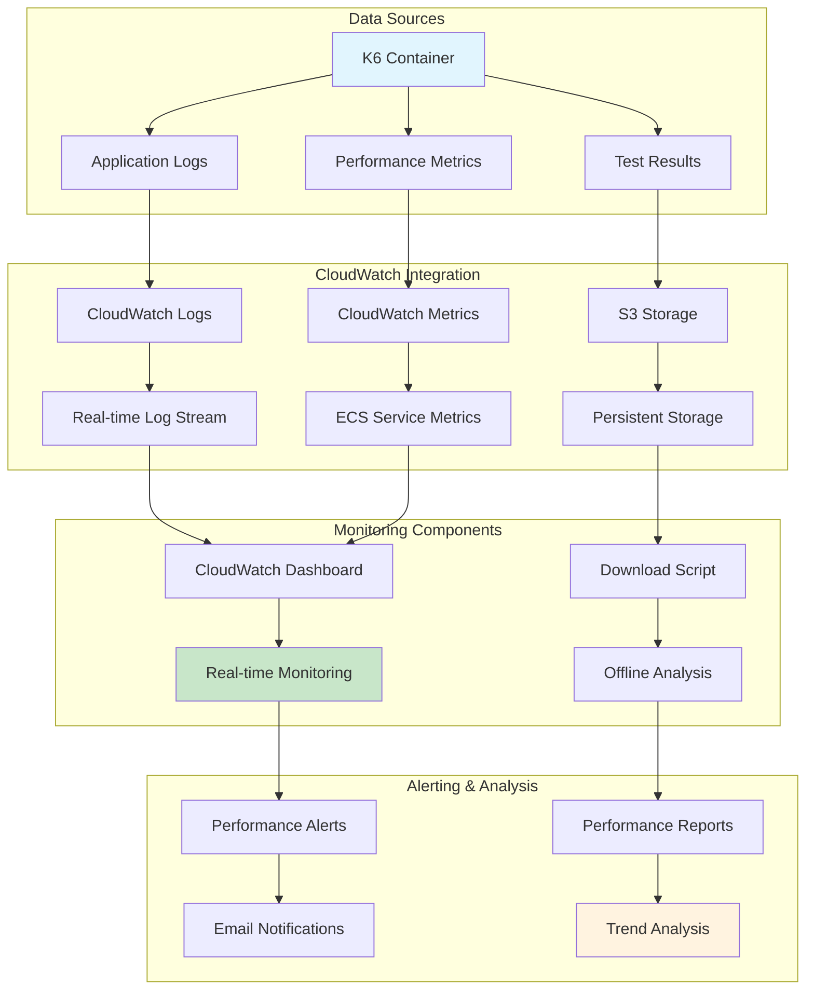

# 🔄 K6 Load Testing Flowcharts

## 📋 Table of Contents

1. [Complete Request Flow](#complete-request-flow)
2. [IP Address Assignment Process](#ip-address-assignment-process)
3. [Test Execution Lifecycle](#test-execution-lifecycle)
4. [Results Processing Pipeline](#results-processing-pipeline)
5. [Network Traffic Flow](#network-traffic-flow)
6. [Data Storage Flow](#data-storage-flow)
7. [Monitoring Flow](#monitoring-flow)

---

## 🔄 Complete Request Flow

### **End-to-End Request Flow Diagram**



---

## 🌐 IP Address Assignment Process

### **Detailed IP Assignment Flow**



### **IP Assignment Code Reference**

```terraform
# VPC Configuration
resource "aws_vpc" "k6_vpc" {
  cidr_block           = "10.0.0.0/16"
  enable_dns_hostnames = true
  enable_dns_support   = true
}

# Public Subnet with Auto-assign Public IP
resource "aws_subnet" "k6_public_subnet" {
  vpc_id                  = aws_vpc.k6_vpc.id
  cidr_block              = "10.0.1.0/24"
  availability_zone       = "us-east-1a"
  map_public_ip_on_launch = true  # ← Enables auto-assign
}

# Internet Gateway for Internet Access
resource "aws_internet_gateway" "k6_igw" {
  vpc_id = aws_vpc.k6_vpc.id
}

# Route Table for Internet Access
resource "aws_route_table" "k6_public_rt" {
  vpc_id = aws_vpc.k6_vpc.id
  route {
    cidr_block = "0.0.0.0/0"  # ← All traffic to internet
    gateway_id = aws_internet_gateway.k6_igw.id
  }
}

# ECS Task with awsvpc Network Mode
resource "aws_ecs_task_definition" "k6_task" {
  network_mode             = "awsvpc"  # ← Required for public IP
  requires_compatibilities = ["FARGATE"]
  cpu                      = 1024
  memory                   = 2048
}
```

---

## 🚀 Test Execution Lifecycle

### **Complete Test Execution Flow**

```mermaid
flowchart TD
    subgraph "Container Startup"
        A[Fargate Starts Container] --> B[Docker Image Pulled]
        B --> C[Container Entry Point]
        C --> D[/scripts/run-k6-with-upload.sh]
    end
    
    subgraph "Environment Setup"
        D --> E[Set Environment Variables]
        E --> F[TARGET_URL=https://affluenceit.com/]
        E --> G[TEST_TYPE=basic]
        E --> H[S3_BUCKET=k6-load-test-results-xxx]
        E --> I[AWS_REGION=us-east-1]
    end
    
    subgraph "K6 Initialization"
        I --> J[k6 run /scripts/basic-load-test.js]
        J --> K[Load Test Script Parsed]
        K --> L[Test Configuration Applied]
        L --> M[VUs Initialized]
    end
    
    subgraph "Virtual User Execution"
        M --> N[VU 1 Starts]
        M --> O[VU 2 Starts]
        M --> P[VU N Starts]
        
        N --> Q[Generate HTTP Request]
        O --> R[Generate HTTP Request]
        P --> S[Generate HTTP Request]
    end
    
    subgraph "Network Processing"
        Q --> T[Container Network Stack]
        R --> T
        S --> T
        T --> U[Public IP: 3.x.x.x]
        U --> V[Internet Gateway]
        V --> W[Internet]
        W --> X[Target Application]
    end
    
    subgraph "Response Processing"
        X --> Y[HTTP Response]
        Y --> Z[K6 Processes Response]
        Z --> AA[Update Metrics]
        AA --> BB[Log Results]
        BB --> CC[Continue Test Loop]
    end
    
    subgraph "Test Completion"
        CC --> DD[All VUs Complete]
        DD --> EE[Generate Results Files]
        EE --> FF[Upload to S3]
        FF --> GG[Container Stops]
    end
    
    style A fill:#e1f5fe
    style X fill:#fff3e0
    style GG fill:#c8e6c9
```

### **K6 Script Execution Flow**

```javascript
// basic-load-test.js - Execution Flow
import http from 'k6/http';
import { check } from 'k6';

// 1. Setup Phase (runs once)
export function setup() {
    console.log(`Starting load test against: ${__ENV.TARGET_URL}`);
    return { targetUrl: __ENV.TARGET_URL };
}

// 2. Main Test Function (runs per VU iteration)
export default function (data) {
    // Each VU executes this function
    const response = http.get(data.targetUrl, {
        insecureSkipTLSVerify: true
    });
    
    check(response, {
        'status is 200': (r) => r.status === 200,
        'response time < 2000ms': (r) => r.timings.duration < 2000,
    });
}

// 3. Teardown Phase (runs once)
export function teardown(data) {
    console.log(`Load test completed for: ${data.targetUrl}`);
}
```

---

## 📊 Results Processing Pipeline

### **Complete Results Processing Flow**

```mermaid
flowchart TD
    subgraph "Test Completion"
        A[K6 Test Finishes] --> B[Generate Results Files]
        B --> C[results.json]
        B --> D[test-summary.json]
        B --> E[k6.log]
    end
    
    subgraph "Local Processing"
        C --> F[Upload Script Triggers]
        D --> F
        E --> F
        F --> G[/scripts/upload-to-s3.sh]
    end
    
    subgraph "S3 Upload Process"
        G --> H[Create S3 Path]
        H --> I[s3://bucket/test-results/basic/20240706-143022/]
        I --> J[Upload results.json]
        I --> K[Upload test-summary.json]
        I --> L[Upload k6.log]
    end
    
    subgraph "CloudWatch Integration"
        A --> M[Real-time Log Stream]
        M --> N[CloudWatch Logs]
        N --> O[/ecs/k6-load-test]
        
        A --> P[Performance Metrics]
        P --> Q[ECS Service Metrics]
        Q --> R[CPU Utilization]
        Q --> S[Memory Utilization]
    end
    
    subgraph "Monitoring & Analysis"
        R --> T[CloudWatch Dashboard]
        S --> T
        O --> T
        
        J --> U[Download Script]
        K --> U
        L --> U
        U --> V[Local Analysis]
        V --> W[Performance Reports]
    end
    
    style A fill:#e1f5fe
    style W fill:#c8e6c9
```

### **S3 Upload Script Flow**

```bash
#!/bin/bash
# upload-to-s3.sh - Upload Process

# 1. Configuration
S3_BUCKET=${S3_BUCKET:-"k6-load-test-results"}
S3_PREFIX=${S3_PREFIX:-"test-results"}
TEST_TYPE=${TEST_TYPE:-"basic"}
TIMESTAMP=$(date +%Y%m%d-%H%M%S)

# 2. Create S3 Path
S3_PATH="s3://${S3_BUCKET}/${S3_PREFIX}/${TEST_TYPE}/${TIMESTAMP}/"

# 3. Upload Results
if [ -f "/results/results.json" ]; then
    aws s3 cp /results/results.json "${S3_PATH}results.json"
fi

# 4. Upload All Files
aws s3 cp /results/ "${S3_PATH}" --recursive

# 5. Create Summary
cat > /tmp/test-summary.json << EOF
{
    "test_type": "${TEST_TYPE}",
    "timestamp": "${TIMESTAMP}",
    "target_url": "${TARGET_URL}",
    "s3_location": "${S3_PATH}"
}
EOF

aws s3 cp /tmp/test-summary.json "${S3_PATH}test-summary.json"
```

---

## 🌐 Network Traffic Flow

### **Detailed Network Flow Diagram**



### **Network Configuration Details**

```terraform
# Network Configuration Flow
resource "aws_vpc" "k6_vpc" {
  cidr_block = "10.0.0.0/16"  # ← VPC CIDR
}

resource "aws_subnet" "k6_public_subnet" {
  vpc_id                  = aws_vpc.k6_vpc.id
  cidr_block              = "10.0.1.0/24"  # ← Subnet CIDR
  map_public_ip_on_launch = true  # ← Auto-assign public IP
}

resource "aws_internet_gateway" "k6_igw" {
  vpc_id = aws_vpc.k6_vpc.id  # ← Internet connectivity
}

resource "aws_route_table" "k6_public_rt" {
  vpc_id = aws_vpc.k6_vpc.id
  route {
    cidr_block = "0.0.0.0/0"  # ← All traffic to internet
    gateway_id = aws_internet_gateway.k6_igw.id
  }
}

# ECS Task Network Configuration
resource "aws_ecs_task_definition" "k6_task" {
  network_mode = "awsvpc"  # ← Each task gets ENI
  # ... other configuration
}
```

---

## 💾 Data Storage Flow

### **Complete Data Storage Architecture**

```mermaid
flowchart TD
    subgraph "Data Generation"
        A[K6 Test Execution] --> B[Generate Metrics]
        A --> C[Generate Logs]
        A --> D[Generate Results]
    end
    
    subgraph "Local Storage"
        B --> E[/results/results.json]
        C --> F[/results/k6.log]
        D --> G[/results/test-summary.json]
    end
    
    subgraph "S3 Storage"
        E --> H[S3 Upload Script]
        F --> H
        G --> H
        H --> I[S3 Bucket]
        I --> J[Organized Structure]
        J --> K[s3://bucket/test-results/basic/20240706-143022/]
    end
    
    subgraph "CloudWatch Storage"
        A --> L[Real-time Log Stream]
        L --> M[CloudWatch Logs]
        M --> N[/ecs/k6-load-test]
        
        A --> O[Performance Metrics]
        O --> P[CloudWatch Metrics]
        P --> Q[ECS Service Metrics]
    end
    
    subgraph "Data Access"
        K --> R[Download Script]
        R --> S[Local Analysis]
        S --> T[Performance Reports]
        
        N --> U[CloudWatch Dashboard]
        Q --> U
    end
    
    style A fill:#e1f5fe
    style T fill:#c8e6c9
    style U fill:#fff3e0
```

### **S3 Storage Structure**

```
s3://k6-load-test-results-[project]-[suffix]/
├── test-results/
│   ├── basic/
│   │   ├── 20240706-143022/
│   │   │   ├── results.json          # Detailed k6 metrics
│   │   │   ├── test-summary.json     # Test metadata
│   │   │   └── k6.log               # Application logs
│   │   └── 20240706-150145/
│   │       ├── results.json
│   │       ├── test-summary.json
│   │       └── k6.log
│   ├── stress/
│   │   └── 20240706-160000/
│   └── spike/
│       └── 20240706-170000/
```

---

## 📊 Monitoring Flow

### **Complete Monitoring Architecture**



### **Monitoring Configuration**

```terraform
# CloudWatch Log Group
resource "aws_cloudwatch_log_group" "k6_logs" {
  name              = "/ecs/${var.project_name}-k6"
  retention_in_days = 7
}

# ECS Task Log Configuration
container_definitions = [
  {
    name = "k6-load-test"
    # ... other configuration
    logConfiguration = {
      logDriver = "awslogs"
      options = {
        awslogs-group         = aws_cloudwatch_log_group.k6_logs.name
        awslogs-region        = var.aws_region
        awslogs-stream-prefix = "k6"
      }
    }
  }
]

# CloudWatch Dashboard
resource "aws_cloudwatch_dashboard" "k6_dashboard" {
  dashboard_name = "${var.project_name}-k6-dashboard"
  dashboard_body = jsonencode({
    widgets = [
      {
        type = "metric"
        properties = {
          metrics = [
            ["AWS/ECS", "CPUUtilization"],
            ["AWS/ECS", "MemoryUtilization"]
          ]
        }
      }
    ]
  })
}
```

---

## 🎯 Summary

This flowchart document provides:

### **Key Flow Components**
1. **IP Assignment**: From task deployment to public IP assignment
2. **Test Execution**: Complete lifecycle from container start to completion
3. **Network Flow**: Detailed traffic routing through VPC
4. **Results Processing**: From local generation to S3 storage
5. **Monitoring**: Real-time metrics and log collection

### **Fargate Role in Each Flow**
- **Resource Allocation**: CPU, memory, and network resources
- **Network Integration**: awsvpc mode with public IP assignment
- **Task Management**: Start, stop, and monitor container execution
- **Logging**: Integration with CloudWatch for real-time monitoring

### **Benefits of This Architecture**
- ✅ **Clear Data Flow**: Each step is documented and traceable
- ✅ **Scalable Design**: Easy to add more tasks or modify flows
- ✅ **Comprehensive Monitoring**: Multiple data collection points
- ✅ **Cost Optimization**: Pay only for actual execution time
- ✅ **Security**: Proper network isolation and access controls

The flowcharts demonstrate how AWS Fargate seamlessly integrates with other AWS services to provide a complete, serverless load testing solution. 