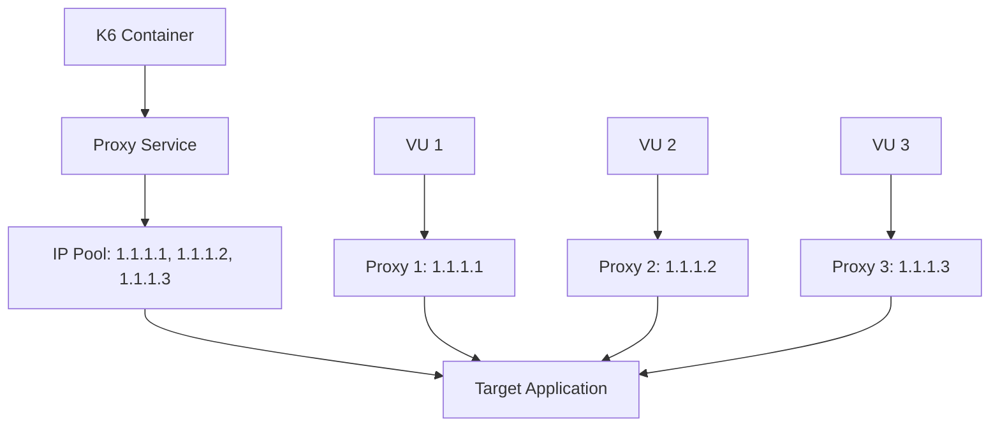
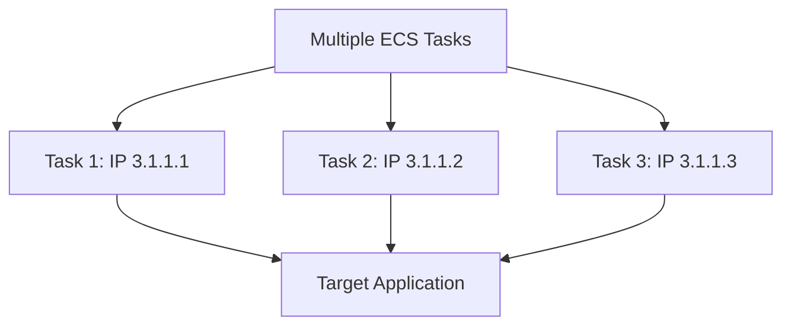
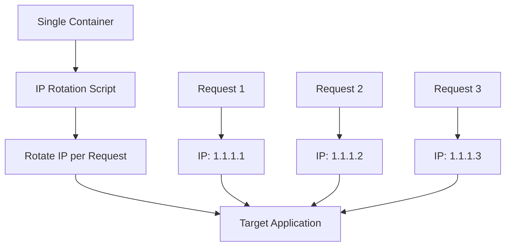
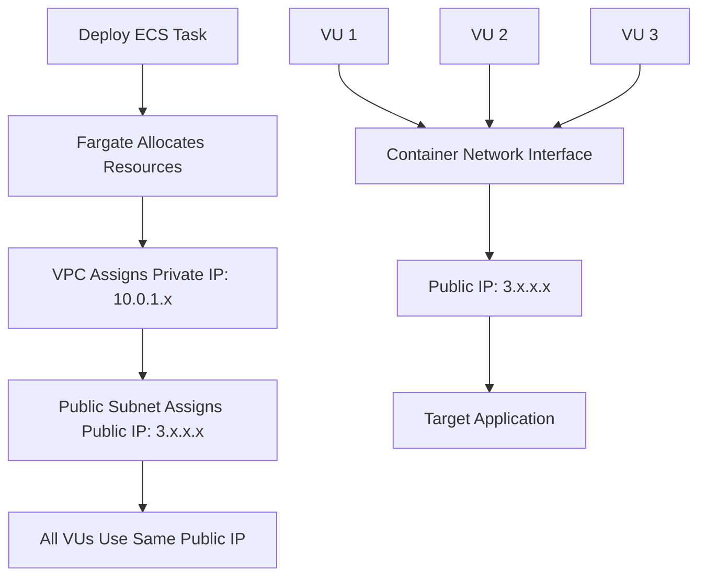

# 🔄 IP Rotation: Detailed Guide

## 📋 Table of Contents

1. [What is IP Rotation?](#what-is-ip-rotation)
2. [Why IP Rotation Matters](#why-ip-rotation-matters)
3. [IP Rotation Methods](#ip-rotation-methods)
4. [Current Project IP Assignment](#current-project-ip-assignment)
5. [IP Rotation vs IP Diversity](#ip-rotation-vs-ip-diversity)
6. [Technical Implementation](#technical-implementation)
7. [Proxy-Based IP Rotation](#proxy-based-ip-rotation)
8. [AWS-Based IP Rotation](#aws-based-ip-rotation)
9. [Container-Level IP Rotation](#container-level-ip-rotation)
10. [Real-World Examples](#real-world-examples)
11. [Challenges and Limitations](#challenges-and-limitations)
12. [Best Practices](#best-practices)

---

## 🎯 What is IP Rotation?

**IP Rotation** is a technique where different IP addresses are used for outgoing requests, either automatically or manually, to simulate traffic from multiple sources.

### **Key Concepts**

- **Dynamic IP Assignment**: IPs change during test execution
- **Geographic Distribution**: IPs from different locations
- **Load Distribution**: Spread requests across multiple IPs
- **Rate Limit Bypass**: Avoid per-IP rate limiting

---

## 🔍 Why IP Rotation Matters

### **Load Testing Scenarios**

| Scenario | **Without IP Rotation** | **With IP Rotation** |
|----------|------------------------|---------------------|
| **Rate Limiting** | ❌ Single IP hits limits quickly | ✅ Multiple IPs bypass limits |
| **Geographic Testing** | ❌ All requests from one location | ✅ Requests from multiple regions |
| **Load Balancer Testing** | ❌ Limited IP diversity | ✅ Tests load balancer with diverse IPs |
| **Security Testing** | ❌ Easy to detect single source | ✅ Harder to detect automated traffic |
| **Realistic Simulation** | ❌ Unrealistic traffic pattern | ✅ Mimics real user behavior |

### **Business Benefits**

1. **More Realistic Testing**: Simulates actual user behavior
2. **Better Performance Data**: Tests how systems handle diverse traffic
3. **Comprehensive Coverage**: Tests rate limiting and security measures
4. **Geographic Distribution**: Tests CDN and regional performance

---

## 🔄 IP Rotation Methods

### **Method 1: Proxy-Based Rotation**



**How it works:**
- Each VU uses a different proxy endpoint
- Proxies have different public IPs
- Requests appear to come from different sources

### **Method 2: AWS-Based Rotation**



**How it works:**
- Each ECS task gets a unique public IP
- AWS automatically assigns different IPs
- Natural IP diversity without external services

### **Method 3: Container-Level Rotation**



**How it works:**
- Single container rotates IPs dynamically
- Uses proxy services or VPN endpoints
- Changes IP during test execution

---

## 🌐 Current Project IP Assignment

### **How Our Project Currently Works**



### **Current Limitations**

1. **Single IP per Container**: All VUs share the same public IP
2. **Limited Diversity**: Only as many IPs as containers
3. **No Geographic Distribution**: All IPs from same AWS region
4. **Static Assignment**: IPs don't change during test execution

### **Current Configuration**

```terraform
# Current setup - each task gets one public IP
resource "aws_ecs_task_definition" "k6_task" {
  network_mode             = "awsvpc"
  requires_compatibilities = ["FARGATE"]
  # Each task gets one public IP from AWS pool
}

# Multiple tasks = multiple IPs
for i in {1..5}; do
  aws ecs run-task --cluster k6-cluster --task-definition k6-task
done
# Results in 5 different public IPs
```

---

## 🔄 IP Rotation vs IP Diversity

### **IP Diversity (Current Project)**

| Aspect | **Current Implementation** |
|--------|---------------------------|
| **IP Assignment** | Static per container |
| **IP Count** | 1 IP per container |
| **Geographic Distribution** | No (all from same region) |
| **Dynamic Changes** | No (IPs don't change) |
| **Cost** | Low (no additional services) |
| **Complexity** | Low |

### **IP Rotation (Advanced)**

| Aspect | **IP Rotation Implementation** |
|--------|------------------------------|
| **IP Assignment** | Dynamic per request/VU |
| **IP Count** | Multiple IPs per container |
| **Geographic Distribution** | Yes (proxy services) |
| **Dynamic Changes** | Yes (IPs change during test) |
| **Cost** | High (proxy services) |
| **Complexity** | High |

---

## 🛠️ Technical Implementation

### **1. Proxy-Based IP Rotation**

#### **Architecture**
```
K6 Container
├── VU 1 → Proxy 1 → IP: 1.1.1.1
├── VU 2 → Proxy 2 → IP: 1.1.1.2
├── VU 3 → Proxy 3 → IP: 1.1.1.3
└── VU N → Proxy N → IP: 1.1.1.N
```

#### **Implementation**
```javascript
// k6 script with proxy rotation
import http from 'k6/http';

const PROXY_LIST = [
    'http://proxy1.service:8080',
    'http://proxy2.service:8080',
    'http://proxy3.service:8080',
    // ... more proxies
];

export default function () {
    // Rotate proxy for each request
    const proxyIndex = __VU % PROXY_LIST.length;
    const proxyUrl = PROXY_LIST[proxyIndex];
    
    const response = http.get('https://affluenceit.com/', {
        proxy: proxyUrl
    });
}
```

#### **Docker Configuration**
```dockerfile
# Dockerfile with proxy support
FROM grafana/k6:latest

# Install proxy tools
RUN apk add --no-cache curl jq

# Copy proxy configuration
COPY proxy-config.json /scripts/
COPY rotate-ip.sh /scripts/
RUN chmod +x /scripts/rotate-ip.sh

# Environment variables
ENV PROXY_ENABLED=true
ENV PROXY_SERVICE_URL=http://proxy-service:8080
```

### **2. AWS-Based IP Rotation**

#### **Architecture**
```
Multiple ECS Tasks
├── Task 1: 10 VUs → IP: 3.1.1.1
├── Task 2: 10 VUs → IP: 3.1.1.2
├── Task 3: 10 VUs → IP: 3.1.1.3
└── Task N: 10 VUs → IP: 3.1.1.N
```

#### **Implementation**
```bash
#!/bin/bash
# Deploy multiple tasks for IP diversity

for i in {1..10}; do
    aws ecs run-task \
        --cluster k6-cluster \
        --task-definition k6-task \
        --launch-type FARGATE \
        --network-configuration "awsvpcConfiguration={subnets=[subnet-123],securityGroups=[sg-123],assignPublicIp=ENABLED}"
done
```

#### **Terraform Configuration**
```terraform
# Multiple tasks with different IPs
resource "aws_ecs_task_definition" "k6_task" {
  count = var.task_count  # Deploy multiple tasks
  
  family                   = "${var.project_name}-k6-task-${count.index}"
  network_mode             = "awsvpc"
  requires_compatibilities = ["FARGATE"]
  
  # Each task gets unique resources
  cpu    = var.task_cpu
  memory = var.task_memory
}
```

### **3. Container-Level IP Rotation**

#### **Architecture**
```
Single Container with IP Rotation
├── VU 1 → IP: 1.1.1.1 (via proxy rotation)
├── VU 2 → IP: 1.1.1.2 (via proxy rotation)
├── VU 3 → IP: 1.1.1.3 (via proxy rotation)
└── VU N → IP: 1.1.1.N (via proxy rotation)
```

#### **Implementation**
```javascript
// Enhanced k6 script with IP rotation
import http from 'k6/http';

// IP rotation configuration
const IP_ROTATION_ENABLED = __ENV.IP_ROTATION_ENABLED === 'true';
const PROXY_SERVICE_URL = __ENV.PROXY_SERVICE_URL || 'http://proxy-service:8080';

// Setup function for IP rotation
export function setup() {
    if (IP_ROTATION_ENABLED) {
        console.log(`Setting up IP rotation for VU ${__VU}`);
        // Configure proxy for this VU
        const proxyConfig = {
            proxy: `${PROXY_SERVICE_URL}/vu/${__VU}`
        };
        return { proxyConfig };
    }
    return {};
}

// Main test function
export default function (data) {
    const options = {};
    
    if (IP_ROTATION_ENABLED && data.proxyConfig) {
        options.proxy = data.proxyConfig.proxy;
    }
    
    const response = http.get('https://affluenceit.com/', options);
    
    check(response, {
        'status is 200': (r) => r.status === 200,
        'response time < 2000ms': (r) => r.timings.duration < 2000,
    });
}
```

#### **IP Rotation Script**
```bash
#!/bin/bash
# rotate-ip.sh

# Function to rotate IP for each VU
rotate_ip() {
    local vu_id=$1
    
    # Get proxy IP from rotation service
    PROXY_IP=$(curl -s "https://proxy-service.com/rotate?vu=$vu_id")
    
    # Configure proxy for this VU
    export HTTP_PROXY="http://$PROXY_IP:8080"
    export HTTPS_PROXY="http://$PROXY_IP:8080"
    
    echo "VU $vu_id using IP: $PROXY_IP"
}

# Export function for k6 to use
export -f rotate_ip
```

---

## 🌍 Proxy-Based IP Rotation

### **How Proxy Services Work**

#### **1. Rotating Proxy Services**
```
Proxy Service Architecture
├── Proxy Pool: 1000+ IPs
├── Geographic Distribution: Global
├── Rotation Algorithm: Round-robin, random, or custom
└── Authentication: API keys or credentials
```

#### **2. Popular Proxy Services**

| Service | **IP Count** | **Geographic Coverage** | **Cost** | **Features** |
|---------|--------------|------------------------|----------|--------------|
| **Bright Data** | 72M+ IPs | 195+ countries | $500+/month | Residential, datacenter, mobile |
| **SmartProxy** | 40M+ IPs | 195+ countries | $75+/month | Residential, datacenter |
| **Oxylabs** | 100M+ IPs | 195+ countries | $300+/month | Residential, datacenter |
| **ProxyMesh** | 1000+ IPs | 8 countries | $75+/month | Datacenter only |

#### **3. Integration with k6**

```javascript
// k6 script with Bright Data proxy
import http from 'k6/http';

const PROXY_CONFIG = {
    host: 'brd.superproxy.io',
    port: 22225,
    username: 'brd-customer-xxx-zone-xxx',
    password: 'xxx'
};

export default function () {
    const response = http.get('https://affluenceit.com/', {
        proxy: `http://${PROXY_CONFIG.username}:${PROXY_CONFIG.password}@${PROXY_CONFIG.host}:${PROXY_CONFIG.port}`
    });
}
```

### **4. VPN-Based Rotation**

```dockerfile
# Dockerfile with VPN support
FROM grafana/k6:latest

# Install VPN client
RUN apk add --no-cache openvpn

# VPN configuration
COPY vpn-config/ /etc/openvpn/
COPY vpn-connect.sh /scripts/
RUN chmod +x /scripts/vpn-connect.sh

# Start VPN before k6
CMD ["/scripts/vpn-connect.sh"]
```

---

## ☁️ AWS-Based IP Rotation

### **1. Multiple ECS Tasks**

#### **Implementation**
```bash
#!/bin/bash
# Deploy multiple tasks for IP diversity

TASK_COUNT=10
CLUSTER_NAME="k6-cluster"
TASK_DEFINITION="k6-task"

for i in {1..$TASK_COUNT}; do
    echo "Starting task $i of $TASK_COUNT"
    
    aws ecs run-task \
        --cluster $CLUSTER_NAME \
        --task-definition $TASK_DEFINITION \
        --launch-type FARGATE \
        --network-configuration "awsvpcConfiguration={subnets=[subnet-123],securityGroups=[sg-123],assignPublicIp=ENABLED}" \
        --overrides "{\"containerOverrides\":[{\"name\":\"k6-load-test\",\"environment\":[{\"name\":\"TASK_INDEX\",\"value\":\"$i\"}]}]}"
    
    # Wait between task starts to avoid overwhelming
    sleep 5
done
```

#### **Terraform Configuration**
```terraform
# Variable for task count
variable "task_count" {
  description = "Number of ECS tasks to run"
  type        = number
  default     = 5
  validation {
    condition     = var.task_count >= 1 && var.task_count <= 20
    error_message = "Task count must be between 1 and 20."
  }
}

# Multiple task definitions
resource "aws_ecs_task_definition" "k6_task" {
  count = var.task_count
  
  family                   = "${var.project_name}-k6-task-${count.index}"
  network_mode             = "awsvpc"
  requires_compatibilities = ["FARGATE"]
  cpu                      = var.task_cpu
  memory                   = var.task_memory
  
  container_definitions = jsonencode([
    {
      name  = "k6-load-test"
      image = "${aws_ecr_repository.k6_repo.repository_url}:latest"
      
      environment = [
        {
          name  = "TASK_INDEX"
          value = tostring(count.index)
        },
        {
          name  = "TARGET_URL"
          value = var.target_url
        }
      ]
    }
  ])
}
```

### **2. Multi-Region Deployment**

#### **Implementation**
```bash
#!/bin/bash
# Deploy to multiple regions for geographic diversity

REGIONS=("us-east-1" "us-west-2" "eu-west-1" "ap-southeast-1")

for region in "${REGIONS[@]}"; do
    echo "Deploying to region: $region"
    
    # Deploy infrastructure in each region
    cd terraform/$region
    terraform apply -var="aws_region=$region"
    
    # Run load test in this region
    aws ecs run-task \
        --cluster k6-cluster-$region \
        --task-definition k6-task \
        --launch-type FARGATE \
        --region $region
done
```

#### **Regional IP Distribution**
```
Multi-Region IP Assignment
├── us-east-1: 3.x.x.x range
├── us-west-2: 4.x.x.x range
├── eu-west-1: 5.x.x.x range
└── ap-southeast-1: 6.x.x.x range
```

### **3. NAT Gateway with Multiple IPs**

#### **Implementation**
```terraform
# Multiple NAT Gateways with different IPs
resource "aws_eip" "nat_1" {
  domain = "vpc"
  tags = {
    Name = "nat-eip-1"
  }
}

resource "aws_eip" "nat_2" {
  domain = "vpc"
  tags = {
    Name = "nat-eip-2"
  }
}

resource "aws_nat_gateway" "nat_1" {
  allocation_id = aws_eip.nat_1.id
  subnet_id     = aws_subnet.public_subnet.id
}

resource "aws_nat_gateway" "nat_2" {
  allocation_id = aws_eip.nat_2.id
  subnet_id     = aws_subnet.public_subnet.id
}

# Route tables for different tasks
resource "aws_route_table" "task_route_1" {
  vpc_id = aws_vpc.k6_vpc.id
  
  route {
    cidr_block = "0.0.0.0/0"
    nat_gateway_id = aws_nat_gateway.nat_1.id
  }
}

resource "aws_route_table" "task_route_2" {
  vpc_id = aws_vpc.k6_vpc.id
  
  route {
    cidr_block = "0.0.0.0/0"
    nat_gateway_id = aws_nat_gateway.nat_2.id
  }
}
```

---

## 🔧 Container-Level IP Rotation

### **1. Dynamic IP Assignment**

#### **Implementation**
```javascript
// k6 script with dynamic IP rotation
import http from 'k6/http';

// IP rotation configuration
const IP_ROTATION_ENABLED = __ENV.IP_ROTATION_ENABLED === 'true';
const PROXY_SERVICE_URL = __ENV.PROXY_SERVICE_URL || 'http://proxy-service:8080';

// Setup function for IP rotation
export function setup() {
    if (IP_ROTATION_ENABLED) {
        console.log(`Setting up IP rotation for VU ${__VU}`);
        // Configure proxy for this VU
        const proxyConfig = {
            proxy: `${PROXY_SERVICE_URL}/vu/${__VU}`
        };
        return { proxyConfig };
    }
    return {};
}

// Main test function
export default function (data) {
    const options = {};
    
    if (IP_ROTATION_ENABLED && data.proxyConfig) {
        options.proxy = data.proxyConfig.proxy;
    }
    
    const response = http.get('https://affluenceit.com/', options);
    
    check(response, {
        'status is 200': (r) => r.status === 200,
        'response time < 2000ms': (r) => r.timings.duration < 2000,
    });
}

// Teardown function
export function teardown(data) {
    if (IP_ROTATION_ENABLED) {
        console.log(`Cleaning up IP rotation for VU ${__VU}`);
    }
}
```

### **2. Proxy Rotation Script**

```bash
#!/bin/bash
# rotate-ip.sh

# Function to rotate IP for each VU
rotate_ip() {
    local vu_id=$1
    
    # Get proxy IP from rotation service
    PROXY_IP=$(curl -s "https://proxy-service.com/rotate?vu=$vu_id")
    
    # Configure proxy for this VU
    export HTTP_PROXY="http://$PROXY_IP:8080"
    export HTTPS_PROXY="http://$PROXY_IP:8080"
    
    echo "VU $vu_id using IP: $PROXY_IP"
}

# Export function for k6 to use
export -f rotate_ip
```

### **3. Enhanced Dockerfile**

```dockerfile
# Enhanced Dockerfile with IP rotation
FROM grafana/k6:latest

# Install proxy tools
RUN apk add --no-cache curl jq aws-cli

# IP rotation script
COPY rotate-ip.sh /scripts/
COPY k6-scripts/ip-rotation-test.js /scripts/
RUN chmod +x /scripts/rotate-ip.sh

# Create results directory
RUN mkdir -p /results

# Health check
HEALTHCHECK --interval=30s --timeout=10s --start-period=5s --retries=3 \
    CMD curl -f http://localhost:6565/ || exit 1

# Default command
CMD ["/scripts/run-k6-with-upload.sh"]
```

---

## 🌍 Real-World Examples

### **Example 1: E-commerce Load Testing**

#### **Scenario**
- **Target**: E-commerce website
- **Challenge**: Rate limiting (100 requests/IP/minute)
- **Solution**: IP rotation with 100 unique IPs

#### **Implementation**
```javascript
// E-commerce load test with IP rotation
import http from 'k6/http';

const PROXY_LIST = [
    'http://proxy1.service:8080',
    'http://proxy2.service:8080',
    // ... 100 proxy endpoints
];

export const options = {
    scenarios: {
        ecommerce_test: {
            executor: 'per-vu-iterations',
            vus: 100,
            iterations: 1000,
            exec: 'ecommerceTest'
        }
    }
};

export function ecommerceTest() {
    // Each VU uses different proxy
    const proxyIndex = __VU % PROXY_LIST.length;
    const proxyUrl = PROXY_LIST[proxyIndex];
    
    // Simulate user browsing
    const response = http.get('https://ecommerce-site.com/', {
        proxy: proxyUrl
    });
    
    // Add products to cart
    http.post('https://ecommerce-site.com/cart', {
        proxy: proxyUrl
    }, {
        product_id: '12345',
        quantity: 1
    });
}
```

### **Example 2: API Rate Limit Testing**

#### **Scenario**
- **Target**: REST API with rate limits
- **Challenge**: Test rate limiting behavior
- **Solution**: Multiple IPs to bypass limits

#### **Implementation**
```bash
#!/bin/bash
# API rate limit testing with multiple IPs

# Deploy 50 tasks for 50 unique IPs
for i in {1..50}; do
    aws ecs run-task \
        --cluster k6-cluster \
        --task-definition k6-api-test \
        --launch-type FARGATE \
        --network-configuration "awsvpcConfiguration={subnets=[subnet-123],securityGroups=[sg-123],assignPublicIp=ENABLED}" \
        --overrides "{\"containerOverrides\":[{\"name\":\"k6-load-test\",\"environment\":[{\"name\":\"API_ENDPOINT\",\"value\":\"https://api.example.com/v1\"},{\"name\":\"TASK_INDEX\",\"value\":\"$i\"}]}]}"
done
```

### **Example 3: Geographic Distribution Testing**

#### **Scenario**
- **Target**: CDN-enabled website
- **Challenge**: Test performance from different regions
- **Solution**: Multi-region deployment

#### **Implementation**
```terraform
# Multi-region deployment
locals {
  regions = ["us-east-1", "us-west-2", "eu-west-1", "ap-southeast-1"]
}

resource "aws_ecs_cluster" "k6_cluster" {
  count = length(local.regions)
  
  name = "${var.project_name}-cluster-${local.regions[count.index]}"
  
  setting {
    name  = "containerInsights"
    value = "enabled"
  }
  
  tags = {
    Name = "${var.project_name}-cluster-${local.regions[count.index]}"
    Region = local.regions[count.index]
  }
}
```

---

## ⚠️ Challenges and Limitations

### **1. Technical Challenges**

| Challenge | **Description** | **Solution** |
|-----------|----------------|--------------|
| **Proxy Reliability** | Proxy services may be unreliable | Use multiple proxy providers |
| **Latency Overhead** | Proxy adds network latency | Choose low-latency proxies |
| **Cost Management** | Proxy services can be expensive | Balance cost vs. requirements |
| **Complexity** | IP rotation adds complexity | Start simple, scale gradually |

### **2. Legal and Ethical Considerations**

| Consideration | **Description** | **Best Practice** |
|---------------|----------------|-------------------|
| **Terms of Service** | Some services prohibit automated traffic | Review and comply with ToS |
| **Rate Limiting** | Respect rate limits even with IP rotation | Use reasonable request rates |
| **Geographic Restrictions** | Some content is region-restricted | Use appropriate geographic IPs |
| **Data Privacy** | Proxy services may log traffic | Choose privacy-focused providers |

### **3. Performance Impact**

| Impact | **Description** | **Mitigation** |
|--------|----------------|----------------|
| **Increased Latency** | Proxy hop adds 50-200ms | Use high-quality proxy services |
| **Reduced Throughput** | Proxy becomes bottleneck | Scale proxy capacity |
| **Connection Overhead** | More complex network path | Optimize connection pooling |
| **Resource Usage** | Additional CPU/memory for proxy | Monitor and optimize |

---

## 🎯 Best Practices

### **1. Start Simple**

```bash
# Start with multiple ECS tasks (easiest)
for i in {1..5}; do
    aws ecs run-task --cluster k6-cluster --task-definition k6-task
done
```

### **2. Scale Gradually**

```javascript
// Start with basic IP diversity
export const options = {
    scenarios: {
        basic_test: {
            executor: 'per-vu-iterations',
            vus: 10,  // Start small
            iterations: 100,
            exec: 'basicTest'
        }
    }
};
```

### **3. Monitor Performance**

```javascript
// Monitor proxy performance
export function handleSummary(data) {
    return {
        'proxy-performance.json': JSON.stringify({
            proxy_latency: data.metrics.http_req_duration.values,
            proxy_errors: data.metrics.http_req_failed.values,
            unique_ips: data.metrics.http_reqs.values.unique_ips
        })
    };
}
```

### **4. Choose Right Method**

| Requirement | **Recommended Method** | **Reason** |
|-------------|----------------------|------------|
| **Basic IP Diversity** | Multiple ECS Tasks | Simple, cost-effective |
| **High IP Count** | Proxy Services | 1000+ unique IPs |
| **Geographic Distribution** | Multi-region + Proxy | Global coverage |
| **Cost Sensitivity** | Multiple ECS Tasks | No additional cost |
| **Professional Testing** | Proxy Services | Enterprise-grade |

### **5. Security Considerations**

```terraform
# Secure proxy configuration
resource "aws_security_group" "proxy_sg" {
  name_prefix = "${var.project_name}-proxy-sg"
  vpc_id      = aws_vpc.k6_vpc.id

  egress {
    from_port   = 0
    to_port     = 0
    protocol    = "-1"
    cidr_blocks = ["0.0.0.0/0"]
  }

  tags = {
    Name = "${var.project_name}-proxy-sg"
  }
}
```

---

## 📊 Summary

### **IP Rotation Methods Comparison**

| Method | **IP Count** | **Cost** | **Complexity** | **Geographic** | **Dynamic** |
|--------|--------------|----------|----------------|----------------|-------------|
| **Multiple ECS Tasks** | 5-20 | Low | Low | No | No |
| **Proxy Services** | 1000+ | High | High | Yes | Yes |
| **Multi-Region** | 20-100 | Medium | Medium | Yes | No |
| **NAT Gateways** | 10-50 | Medium | Medium | No | No |

### **Recommendations**

1. **Start with Multiple ECS Tasks**: Simple, cost-effective, immediate results
2. **Evaluate Needs**: Monitor rate limiting and IP diversity requirements
3. **Scale to Proxy Services**: Only if high IP diversity is required
4. **Consider Multi-Region**: For geographic distribution needs
5. **Monitor Performance**: Track latency and throughput impact

### **Key Takeaways**

- **IP Rotation** provides dynamic IP assignment during test execution
- **IP Diversity** provides static IP assignment per container
- **Current Project** uses IP diversity (multiple tasks = multiple IPs)
- **Advanced IP Rotation** requires proxy services or VPN integration
- **Choose based on requirements**: Cost, complexity, IP count, geographic needs

IP rotation is a powerful technique for realistic load testing, but it should be implemented based on specific requirements and constraints! 🚀 