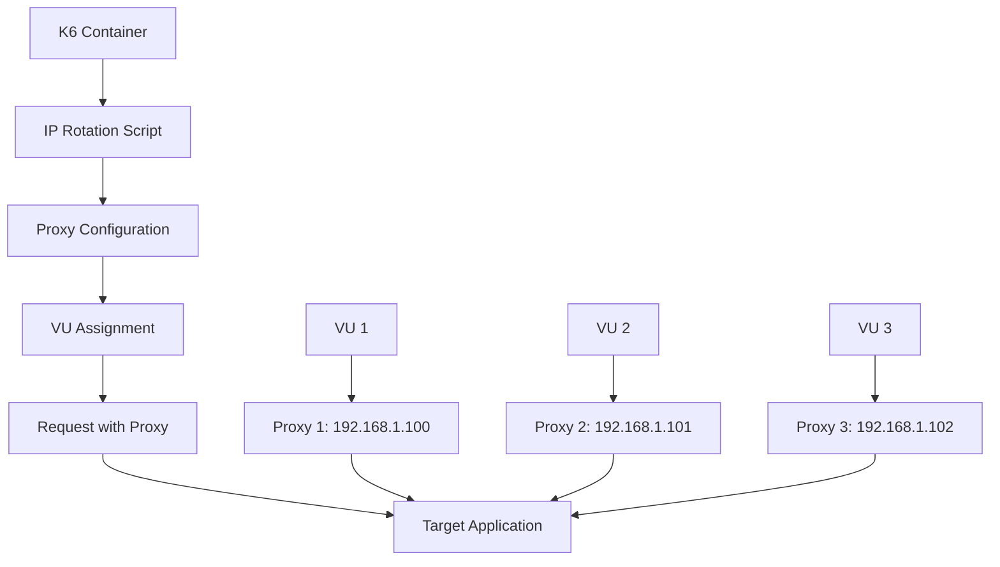

# 🔄 IP Rotation Implementation Guide

## 📋 Table of Contents

1. [Overview](#overview)
2. [Implementation Details](#implementation-details)
3. [Configuration Options](#configuration-options)
4. [Usage Examples](#usage-examples)
5. [Testing and Validation](#testing-and-validation)
6. [Troubleshooting](#troubleshooting)
7. [Best Practices](#best-practices)

---

## 🎯 Overview

This guide explains how to implement and use IP rotation in the k6 load testing project. The implementation provides container-level IP rotation where each Virtual User (VU) can use a unique IP address for making requests.

### **Key Features**

- ✅ **Container-Level IP Rotation**: Each VU gets a unique IP
- ✅ **Multiple Proxy Types**: Static, rotating, Tor, Privoxy
- ✅ **VU-IP Mapping**: Track which VU uses which IP
- ✅ **Proxy Testing**: Validate proxy connectivity
- ✅ **AWS Integration**: Seamless deployment with ECS
- ✅ **Results Tracking**: Detailed IP rotation metrics

---

## 🛠️ Implementation Details

### **Architecture**



### **Components**

#### **1. Dockerfile Enhancements**
```dockerfile
# Enhanced Dockerfile with IP rotation support
FROM grafana/k6:latest

# Install proxy tools
RUN apk add --no-cache \
    curl \
    jq \
    aws-cli \
    openvpn \
    tor \
    privoxy

# Copy IP rotation scripts
COPY rotate-ip.sh /scripts/
COPY setup-proxy.sh /scripts/

# Set environment variables
ENV IP_ROTATION_ENABLED=false
ENV PROXY_TYPE="static"
ENV VU_IP_MAPPING_ENABLED=false
```

#### **2. IP Rotation Script (`rotate-ip.sh`)**
- **Static Proxy**: Round-robin assignment of proxy IPs
- **Rotating Proxy**: Dynamic proxy assignment via service
- **Tor Proxy**: SOCKS5 proxy for anonymity
- **OpenVPN**: VPN-based IP rotation

#### **3. Proxy Setup Script (`setup-proxy.sh`)**
- **Mock Proxy Service**: Python-based proxy rotation service
- **Privoxy**: HTTP proxy with filtering
- **Tor**: Anonymous proxy network
- **Service Testing**: Connectivity validation

#### **4. Enhanced k6 Scripts**
- **IP Rotation Test**: Dedicated IP rotation testing
- **Basic Load Test with IP Rotation**: Enhanced basic test
- **Custom Metrics**: IP rotation success rate, unique IPs used
- **Proxy Mapping**: Track VU to IP assignments

---

## ⚙️ Configuration Options

### **Environment Variables**

| Variable | **Description** | **Default** | **Options** |
|----------|----------------|-------------|-------------|
| `IP_ROTATION_ENABLED` | Enable IP rotation | `false` | `true`, `false` |
| `PROXY_TYPE` | Type of proxy to use | `static` | `static`, `rotating`, `tor`, `privoxy` |
| `PROXY_SERVICE_URL` | URL for proxy service | `http://localhost:8080` | Any HTTP URL |
| `VU_IP_MAPPING_ENABLED` | Track VU-IP mapping | `false` | `true`, `false` |
| `MAX_PROXY_IPS` | Maximum proxy IPs available | `10` | `1-100` |
| `TEST_PROXY` | Test proxy connectivity | `false` | `true`, `false` |

### **Terraform Variables**

```hcl
# IP Rotation Configuration
variable "ip_rotation_enabled" {
  description = "Enable IP rotation for load testing"
  type        = string
  default     = "false"
}

variable "proxy_type" {
  description = "Type of proxy to use for IP rotation"
  type        = string
  default     = "static"
}

variable "proxy_service_url" {
  description = "URL for proxy rotation service"
  type        = string
  default     = "http://localhost:8080"
}
```

---

## 🚀 Usage Examples

### **Example 1: Basic IP Rotation**

```bash
# Deploy with IP rotation enabled
terraform apply \
  -var="ip_rotation_enabled=true" \
  -var="proxy_type=static" \
  -var="max_proxy_ips=10"

# Run load test
aws ecs run-task \
  --cluster k6-load-test-cluster \
  --task-definition k6-load-test-k6-task \
  --launch-type FARGATE \
  --network-configuration "awsvpcConfiguration={subnets=[subnet-123],securityGroups=[sg-123],assignPublicIp=ENABLED}"
```

### **Example 2: Rotating Proxy Service**

```bash
# Deploy with rotating proxy
terraform apply \
  -var="ip_rotation_enabled=true" \
  -var="proxy_type=rotating" \
  -var="proxy_service_url=http://proxy-service.com/rotate" \
  -var="vu_ip_mapping_enabled=true"

# Run with custom test script
aws ecs run-task \
  --cluster k6-load-test-cluster \
  --task-definition k6-load-test-k6-task \
  --launch-type FARGATE \
  --overrides '{"containerOverrides":[{"name":"k6-load-test","environment":[{"name":"TEST_SCRIPT","value":"/scripts/ip-rotation-test.js"}]}]}'
```

### **Example 3: Tor Proxy**

```bash
# Deploy with Tor proxy
terraform apply \
  -var="ip_rotation_enabled=true" \
  -var="proxy_type=tor" \
  -var="test_proxy=true"

# Run test
aws ecs run-task \
  --cluster k6-load-test-cluster \
  --task-definition k6-load-test-k6-task \
  --launch-type FARGATE
```

### **Example 4: Multiple Tasks for IP Diversity**

```bash
# Deploy multiple tasks for natural IP diversity
for i in {1..5}; do
  aws ecs run-task \
    --cluster k6-load-test-cluster \
    --task-definition k6-load-test-k6-task \
    --launch-type FARGATE \
    --network-configuration "awsvpcConfiguration={subnets=[subnet-123],securityGroups=[sg-123],assignPublicIp=ENABLED}" \
    --overrides "{\"containerOverrides\":[{\"name\":\"k6-load-test\",\"environment\":[{\"name\":\"TASK_INDEX\",\"value\":\"$i\"}]}]}"
done
```

---

## 🧪 Testing and Validation

### **1. Proxy Connectivity Test**

```bash
# Test proxy service locally
curl -s http://localhost:8080/rotate?vu=1

# Expected response
{
  "proxy_ip": "192.168.1.100:8080",
  "vu_id": "1",
  "timestamp": 1640995200
}
```

### **2. IP Rotation Validation**

```javascript
// k6 script validation
export function setup() {
    if (IP_ROTATION_ENABLED) {
        // Test proxy connectivity
        const testResponse = http.get('https://httpbin.org/ip', {
            proxy: proxyConfig.proxy,
            timeout: '10s'
        });
        
        if (testResponse.status === 200) {
            console.log(`Proxy test successful: ${testResponse.body}`);
        }
    }
}
```

### **3. VU-IP Mapping Validation**

```javascript
// Track VU to IP mapping
let vuProxyMap = new Map();

export default function (data) {
    if (IP_ROTATION_ENABLED && data.proxyConfig) {
        vuProxyMap.set(__VU, data.proxyConfig.proxy);
        console.log(`VU ${__VU} using proxy: ${data.proxyConfig.proxy}`);
    }
}
```

### **4. Results Validation**

```bash
# Check IP rotation results
aws s3 ls s3://k6-load-test-results-123456789/ip-rotation-results/

# Download and analyze results
aws s3 cp s3://k6-load-test-results-123456789/ip-rotation-results/ip-rotation-summary.json .
cat ip-rotation-summary.json
```

---

## 🔧 Troubleshooting

### **Common Issues**

#### **1. Proxy Connection Failed**
```bash
# Check proxy service status
curl -s http://localhost:8080/status

# Check proxy logs
docker logs <container_id> | grep proxy
```

**Solution**: Ensure proxy service is running and accessible

#### **2. IP Rotation Not Working**
```bash
# Check environment variables
docker exec <container_id> env | grep IP_ROTATION

# Check k6 logs
docker logs <container_id> | grep "IP rotation"
```

**Solution**: Verify `IP_ROTATION_ENABLED=true` and proxy configuration

#### **3. VU-IP Mapping Issues**
```javascript
// Debug VU-IP mapping
export default function (data) {
    console.log(`VU ${__VU} proxy config:`, data.proxyConfig);
}
```

**Solution**: Enable `VU_IP_MAPPING_ENABLED=true`

#### **4. AWS ECS Task Issues**
```bash
# Check ECS task status
aws ecs describe-tasks \
  --cluster k6-load-test-cluster \
  --tasks <task_arn>

# Check CloudWatch logs
aws logs describe-log-streams \
  --log-group-name /ecs/k6-load-test-k6
```

**Solution**: Verify task definition and IAM permissions

### **Debug Commands**

```bash
# Test proxy service locally
docker run -it --rm \
  -e IP_ROTATION_ENABLED=true \
  -e PROXY_TYPE=static \
  k6-load-test:latest \
  /scripts/rotate-ip.sh 1

# Test k6 with IP rotation
docker run -it --rm \
  -e IP_ROTATION_ENABLED=true \
  -e PROXY_TYPE=static \
  -e TARGET_URL=https://httpbin.org/ip \
  k6-load-test:latest \
  k6 run /scripts/ip-rotation-test.js
```

---

## 📊 Best Practices

### **1. Proxy Selection**

| Use Case | **Recommended Proxy** | **Reason** |
|----------|----------------------|------------|
| **Basic Testing** | Static proxy | Simple, reliable |
| **High IP Diversity** | Rotating proxy service | Dynamic IP assignment |
| **Anonymity** | Tor proxy | Anonymous browsing |
| **Enterprise** | Privoxy | Advanced filtering |

### **2. Performance Optimization**

```javascript
// Optimize proxy usage
export default function (data) {
    const options = {};
    
    if (IP_ROTATION_ENABLED && data.proxyConfig) {
        options.proxy = data.proxyConfig.proxy;
        options.timeout = '30s';  // Increase timeout for proxy
    }
    
    const response = http.get(TARGET_URL, options);
}
```

### **3. Monitoring and Metrics**

```javascript
// Custom metrics for IP rotation
const ip_rotation_success = new Rate('ip_rotation_success');
const unique_ips_used = new Rate('unique_ips_used');

export function setup() {
    if (IP_ROTATION_ENABLED) {
        const testResponse = http.get('https://httpbin.org/ip', {
            proxy: proxyConfig.proxy
        });
        
        ip_rotation_success.add(testResponse.status === 200 ? 1 : 0);
    }
}
```

### **4. Security Considerations**

- ✅ **Use HTTPS proxies** when possible
- ✅ **Validate proxy sources** before use
- ✅ **Monitor proxy performance** and reliability
- ✅ **Implement fallback mechanisms** for proxy failures
- ✅ **Log proxy usage** for audit purposes

### **5. Cost Optimization**

```bash
# Use multiple ECS tasks for natural IP diversity
for i in {1..10}; do
    aws ecs run-task --cluster k6-cluster --task-definition k6-task
done

# Instead of expensive proxy services for basic testing
```

---

## 📈 Expected Results

### **IP Rotation Metrics**

| Metric | **Description** | **Expected Value** |
|--------|----------------|-------------------|
| `ip_rotation_success` | Proxy connectivity success rate | > 80% |
| `unique_ips_used` | Number of unique IPs used | = Number of VUs |
| `proxy_response_time` | Proxy latency | < 2000ms |
| `http_req_duration` | Total request duration | < 5000ms |

### **Sample Results**

```json
{
  "ip_rotation_enabled": true,
  "proxy_type": "static",
  "vu_count": 10,
  "ip_rotation_success_rate": 0.95,
  "unique_ips_used": 10,
  "avg_response_time": 1500,
  "p95_response_time": 2500,
  "proxy_assignments": [
    ["1", "http://192.168.1.100:8080"],
    ["2", "http://192.168.1.101:8080"],
    ["3", "http://192.168.1.102:8080"]
  ]
}
```

---

## 🎯 Summary

The IP rotation implementation provides:

1. **Container-Level IP Rotation**: Each VU gets a unique IP
2. **Multiple Proxy Types**: Static, rotating, Tor, Privoxy
3. **VU-IP Mapping**: Track which VU uses which IP
4. **AWS Integration**: Seamless deployment with ECS
5. **Comprehensive Monitoring**: Detailed metrics and logging
6. **Flexible Configuration**: Environment-based configuration
7. **Robust Testing**: Proxy connectivity validation

This implementation enables realistic load testing with IP diversity, helping to test rate limiting, geographic distribution, and load balancer behavior effectively! 🚀 