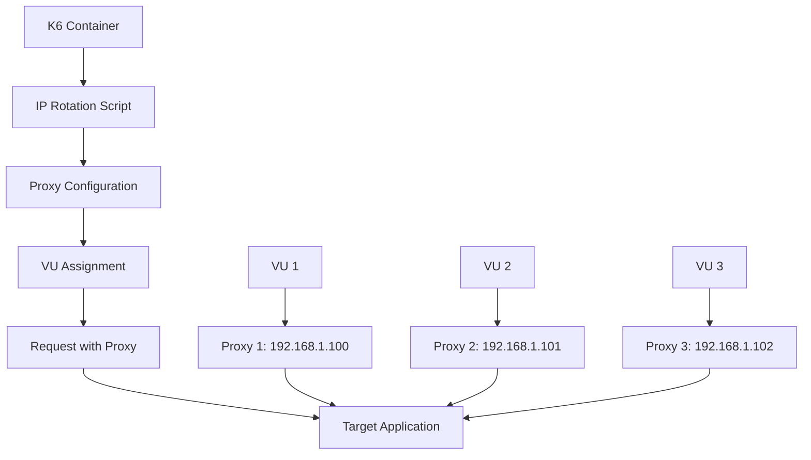

# 🚀 k6 Load Testing with IP Rotation

A comprehensive k6 load testing solution deployed on AWS ECS with **container-level IP rotation** support. Each Virtual User (VU) can use a unique IP address for making requests, enabling realistic load testing scenarios.

## ✨ Features

- 🔄 **Container-Level IP Rotation**: Each VU gets a unique IP address
- 🌐 **Multiple Proxy Types**: Static, rotating, Tor, Privoxy
- 📊 **VU-IP Mapping**: Track which VU uses which IP
- ☁️ **AWS ECS Deployment**: Serverless container orchestration
- 📈 **CloudWatch Monitoring**: Real-time metrics and dashboards
- 📦 **S3 Results Storage**: Persistent test results and reports
- 🛠️ **Terraform Infrastructure**: Infrastructure as Code
- 🔧 **Flexible Configuration**: Environment-based settings

## 🏗️ Architecture



## 🚀 Quick Start

### Prerequisites

- AWS CLI configured
- Terraform installed
- Docker installed

### 1. Clone and Setup

```bash
git clone <repository-url>
cd iploads-with-k6-container

# Configure AWS credentials
aws configure
```

### 2. Deploy Infrastructure

```bash
cd terraform

# Deploy with IP rotation enabled
terraform init
terraform apply \
  -var="ip_rotation_enabled=true" \
  -var="proxy_type=static" \
  -var="max_proxy_ips=10"
```

### 3. Build and Push Docker Image

```bash
# Get ECR repository URL
ECR_REPO=$(terraform output -raw ecr_repository_url)

# Build and push image
docker build -t k6-load-test:latest ../docker/
aws ecr get-login-password --region us-east-1 | docker login --username AWS --password-stdin $ECR_REPO
docker tag k6-load-test:latest $ECR_REPO:latest
docker push $ECR_REPO:latest
```

### 4. Run Load Test

```bash
# Get cluster and task definition names
CLUSTER_NAME=$(terraform output -raw ecs_cluster_name)
TASK_DEFINITION=$(terraform output -raw ecs_task_definition_arn)

# Run load test with IP rotation
aws ecs run-task \
  --cluster $CLUSTER_NAME \
  --task-definition $TASK_DEFINITION \
  --launch-type FARGATE \
  --network-configuration "awsvpcConfiguration={subnets=[$(terraform output -raw public_subnet_id)],securityGroups=[$(terraform output -raw security_group_id)],assignPublicIp=ENABLED}"
```

## ⚙️ Configuration

### IP Rotation Options

| Variable | **Description** | **Default** | **Options** |
|----------|----------------|-------------|-------------|
| `IP_ROTATION_ENABLED` | Enable IP rotation | `false` | `true`, `false` |
| `PROXY_TYPE` | Type of proxy to use | `static` | `static`, `rotating`, `tor`, `privoxy` |
| `PROXY_SERVICE_URL` | URL for proxy service | `http://localhost:8080` | Any HTTP URL |
| `VU_IP_MAPPING_ENABLED` | Track VU-IP mapping | `false` | `true`, `false` |
| `MAX_PROXY_IPS` | Maximum proxy IPs available | `10` | `1-100` |
| `TEST_PROXY` | Test proxy connectivity | `false` | `true`, `false` |

### Usage Examples

#### **Basic IP Rotation**
```bash
terraform apply \
  -var="ip_rotation_enabled=true" \
  -var="proxy_type=static" \
  -var="max_proxy_ips=10"
```

#### **Rotating Proxy Service**
```bash
terraform apply \
  -var="ip_rotation_enabled=true" \
  -var="proxy_type=rotating" \
  -var="proxy_service_url=http://proxy-service.com/rotate" \
  -var="vu_ip_mapping_enabled=true"
```

#### **Tor Proxy**
```bash
terraform apply \
  -var="ip_rotation_enabled=true" \
  -var="proxy_type=tor" \
  -var="test_proxy=true"
```

#### **Multiple Tasks for Natural IP Diversity**
```bash
# Deploy multiple tasks (each gets unique AWS public IP)
for i in {1..5}; do
  aws ecs run-task \
    --cluster k6-load-test-cluster \
    --task-definition k6-load-test-k6-task \
    --launch-type FARGATE \
    --network-configuration "awsvpcConfiguration={subnets=[subnet-123],securityGroups=[sg-123],assignPublicIp=ENABLED}"
done
```

## 📊 Test Scripts

### Available Test Scripts

1. **`basic-load-test-with-ip-rotation.js`**: Enhanced basic test with IP rotation
2. **`ip-rotation-test.js`**: Dedicated IP rotation testing
3. **`stress-test.js`**: Stress testing with IP rotation
4. **`spike-test.js`**: Spike testing with IP rotation

### Custom Test Script

```javascript
// Example k6 script with IP rotation
import http from 'k6/http';
import { check } from 'k6';

const TARGET_URL = __ENV.TARGET_URL || 'https://affluenceit.com/';
const IP_ROTATION_ENABLED = __ENV.IP_ROTATION_ENABLED === 'true';

export function setup() {
    if (IP_ROTATION_ENABLED) {
        console.log(`[VU ${__VU}] IP rotation enabled`);
        // Configure proxy for this VU
        return { proxyConfig: getProxyConfig(__VU) };
    }
    return {};
}

export default function (data) {
    const options = {};
    
    if (IP_ROTATION_ENABLED && data.proxyConfig) {
        options.proxy = data.proxyConfig.proxy;
    }
    
    const response = http.get(TARGET_URL, options);
    
    check(response, {
        'status is 200': (r) => r.status === 200,
        'proxy used': (r) => IP_ROTATION_ENABLED ? data.proxyConfig !== null : true,
    });
}
```

## 📈 Monitoring and Results

### CloudWatch Dashboard

Access the CloudWatch dashboard to monitor:
- ECS CPU and Memory utilization
- k6 metrics (requests, response times, errors)
- IP rotation success rates

### S3 Results

Test results are automatically uploaded to S3:
- **Standard results**: `s3://k6-load-test-results-<account-id>/load-test-results/`
- **IP rotation results**: `s3://k6-load-test-results-<account-id>/ip-rotation-results/`

### Sample Results

```json
{
  "ip_rotation_enabled": true,
  "proxy_type": "static",
  "vu_count": 10,
  "ip_rotation_success_rate": 0.95,
  "unique_ips_used": 10,
  "avg_response_time": 1500,
  "p95_response_time": 2500,
  "proxy_assignments": [
    ["1", "http://192.168.1.100:8080"],
    ["2", "http://192.168.1.101:8080"],
    ["3", "http://192.168.1.102:8080"]
  ]
}
```

## 🔧 Troubleshooting

### Common Issues

#### **1. Proxy Connection Failed**
```bash
# Check proxy service status
curl -s http://localhost:8080/status

# Check container logs
aws logs describe-log-streams --log-group-name /ecs/k6-load-test-k6
```

#### **2. IP Rotation Not Working**
```bash
# Check environment variables
aws ecs describe-tasks --cluster k6-load-test-cluster --tasks <task_arn>
```

#### **3. AWS ECS Task Issues**
```bash
# Check task status
aws ecs describe-tasks --cluster k6-load-test-cluster --tasks <task_arn>

# Check CloudWatch logs
aws logs describe-log-streams --log-group-name /ecs/k6-load-test-k6
```

## 📚 Documentation

- **[IP Rotation Implementation Guide](IP_ROTATION_IMPLEMENTATION_GUIDE.md)**: Detailed implementation guide
- **[IP Rotation Detailed Guide](IP_ROTATION_DETAILED_GUIDE.md)**: Comprehensive IP rotation explanation
- **[Solution Architecture](SOLUTION_ARCHITECTURE.md)**: System architecture and flow diagrams
- **[Deployment Guide](DEPLOYMENT_GUIDE.md)**: Step-by-step deployment instructions

## 🎯 Use Cases

### **1. Rate Limit Testing**
- Test applications with per-IP rate limits
- Bypass rate limiting with multiple IPs
- Validate rate limiting behavior

### **2. Geographic Distribution Testing**
- Test CDN performance from different locations
- Validate geographic load balancing
- Test regional restrictions

### **3. Load Balancer Testing**
- Test load balancer with diverse IP sources
- Validate session affinity
- Test IP-based routing

### **4. Security Testing**
- Test IP-based security rules
- Validate firewall configurations
- Test DDoS protection

## 🤝 Contributing

1. Fork the repository
2. Create a feature branch
3. Make your changes
4. Add tests if applicable
5. Submit a pull request

## 📄 License

This project is licensed under the MIT License - see the [LICENSE](LICENSE) file for details.

## 🆘 Support

For support and questions:
- Create an issue in the repository
- Check the documentation files
- Review the troubleshooting section

---

**Happy Load Testing with IP Rotation! 🚀** 