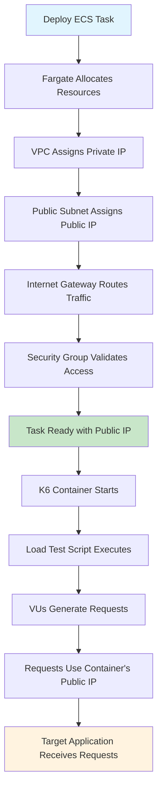
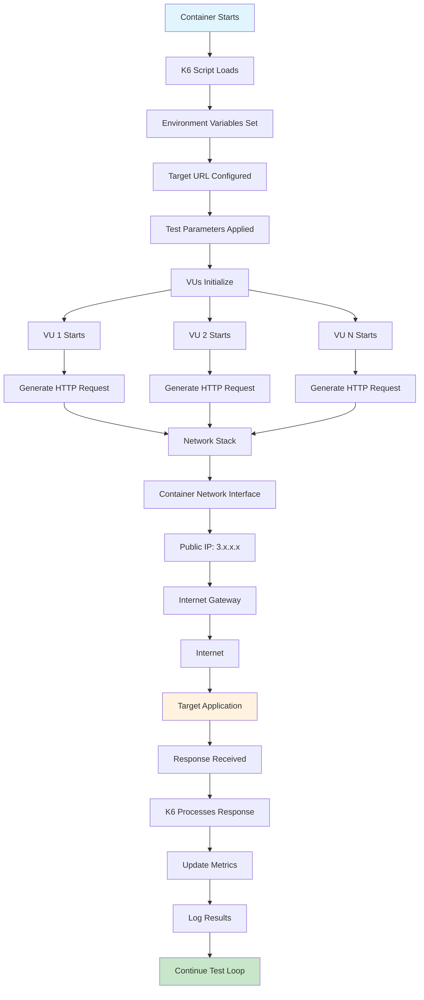
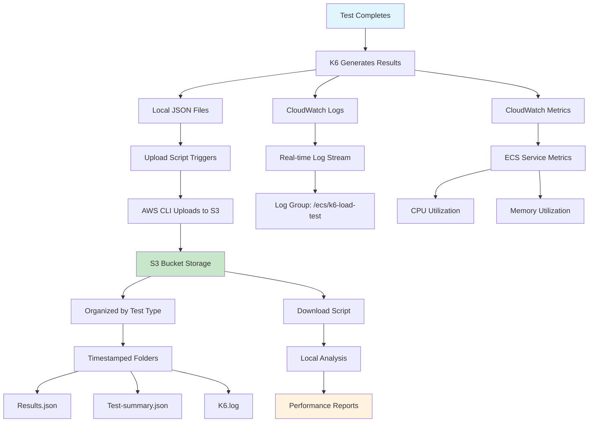
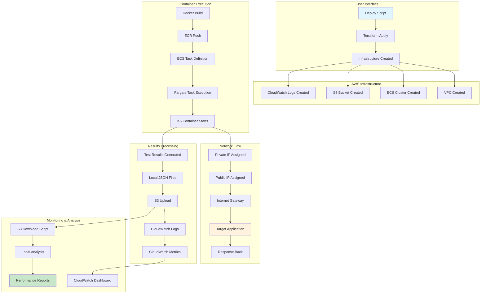
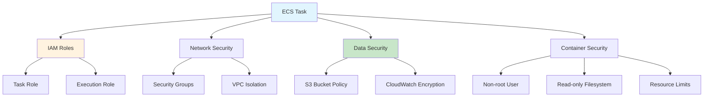
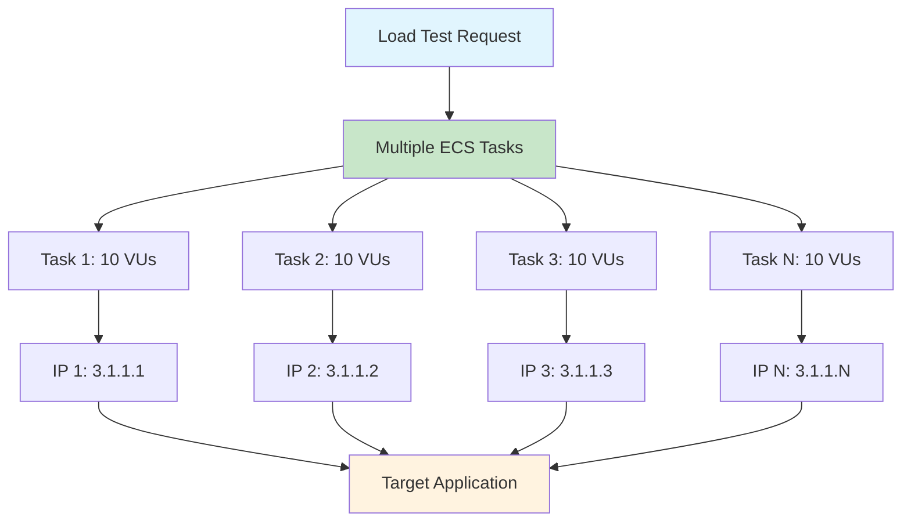
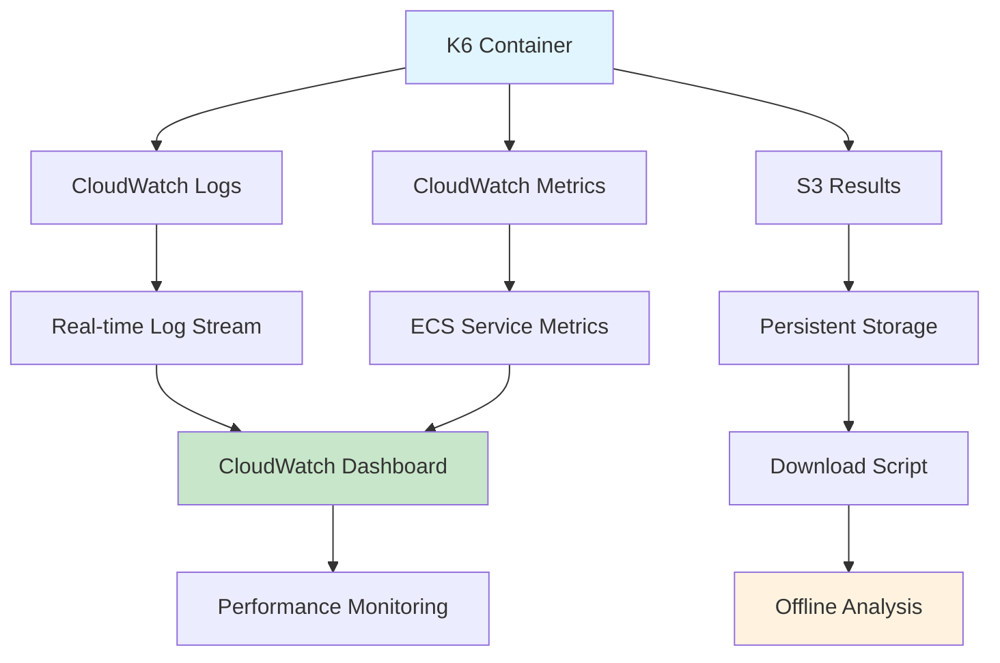
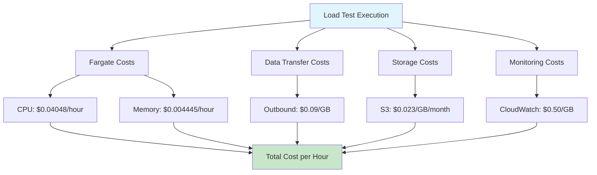

# 🏗️ K6 Load Testing Solution Architecture

## 📋 Table of Contents

1. [Overview](#overview)
2. [System Architecture](#system-architecture)
3. [Component Details](#component-details)
4. [Request Flow Diagrams](#request-flow-diagrams)
5. [IP Address Assignment Flow](#ip-address-assignment-flow)
6. [Test Execution Flow](#test-execution-flow)
7. [Results Processing Flow](#results-processing-flow)
8. [Data Flow Architecture](#data-flow-architecture)
9. [Security Architecture](#security-architecture)
10. [Scalability Considerations](#scalability-considerations)
11. [Monitoring & Observability](#monitoring--observability)
12. [Cost Optimization](#cost-optimization)

---

## 🎯 Overview

This document provides a comprehensive view of the K6 Load Testing solution architecture, detailing how AWS Fargate, ECS, and other components work together to deliver scalable, serverless load testing capabilities.

### **Key Objectives**
- **Serverless Load Testing**: No server management required
- **IP Diversity**: Multiple unique IP addresses for realistic testing
- **Scalable Architecture**: Handle varying load testing requirements
- **Cost Optimization**: Pay only for actual test execution
- **Comprehensive Monitoring**: Real-time metrics and logging

---

## 🏗️ System Architecture

### **High-Level Architecture Diagram**

```
┌─────────────────────────────────────────────────────────────────────────────┐
│                           AWS Cloud Infrastructure                        │
├─────────────────────────────────────────────────────────────────────────────┤
│                                                                             │
│  ┌─────────────────┐    ┌─────────────────┐    ┌─────────────────┐        │
│  │   ECR Registry  │    │   ECS Cluster   │    │   CloudWatch    │        │
│  │                 │    │                 │    │                 │        │
│  │ ┌─────────────┐ │    │ ┌─────────────┐ │    │ ┌─────────────┐ │        │
│  │ │   K6 Image  │ │    │ │ Fargate     │ │    │ │   Logs      │ │        │
│  │ │   Container │ │    │ │ Tasks       │ │    │ │   Metrics   │ │        │
│  │ └─────────────┘ │    │ └─────────────┘ │    │ └─────────────┘ │        │
│  └─────────────────┘    └─────────────────┘    └─────────────────┘        │
│           │                       │                       │                │
│           │                       │                       │                │
│  ┌─────────────────┐    ┌─────────────────┐    ┌─────────────────┐        │
│  │   S3 Bucket     │    │   VPC Network   │    │   IAM Roles     │        │
│  │                 │    │                 │    │                 │        │
│  │ ┌─────────────┐ │    │ ┌─────────────┐ │    │ ┌─────────────┐ │        │
│  │ │ Test Results│ │    │ │ Public      │ │    │ │ Task Role   │ │        │
│  │ │ Logs        │ │    │ │ Subnet      │ │    │ │ Execution   │ │        │
│  │ │ Metrics     │ │    │ │ IGW         │ │    │ │ Role        │ │        │
│  │ └─────────────┘ │    │ └─────────────┘ │    │ └─────────────┘ │        │
│  └─────────────────┘    └─────────────────┘    └─────────────────┘        │
│                                                                             │
└─────────────────────────────────────────────────────────────────────────────┘
                                    │
                                    ▼
┌─────────────────────────────────────────────────────────────────────────────┐
│                        Target Application                                 │
│                    https://affluenceit.com/                              │
└─────────────────────────────────────────────────────────────────────────────┘
```

---

## 🔧 Component Details

### **1. AWS Fargate (Serverless Compute)**

**Role**: Provides serverless compute capacity for running k6 containers

**Key Characteristics**:
- **No Server Management**: AWS handles underlying infrastructure
- **Pay-per-Task**: Only pay when containers are running
- **Automatic Scaling**: Start/stop based on demand
- **VPC Integration**: Direct network access with public IPs

**Configuration**:
```terraform
resource "aws_ecs_task_definition" "k6_task" {
  family                   = "${var.project_name}-k6-task"
  network_mode             = "awsvpc"
  requires_compatibilities = ["FARGATE"]
  cpu                      = var.task_cpu
  memory                   = var.task_memory
}
```

### **2. ECS (Elastic Container Service)**

**Role**: Orchestrates container execution and management

**Key Functions**:
- **Task Scheduling**: Determines where to run containers
- **Resource Management**: Allocates CPU/memory to tasks
- **Service Discovery**: Enables container communication
- **Health Monitoring**: Tracks container health

### **3. VPC Network Infrastructure**

**Components**:
- **VPC**: Isolated network environment
- **Public Subnet**: Internet-accessible resources
- **Internet Gateway**: Internet connectivity
- **Route Tables**: Traffic routing rules
- **Security Groups**: Network access control

**Network Flow**:
```
ECS Task → Public Subnet → Internet Gateway → Internet → Target Application
```

### **4. S3 Storage**

**Role**: Persistent storage for test results and logs

**Storage Structure**:
```
s3://k6-load-test-results-[project]-[suffix]/
├── test-results/
│   ├── basic/
│   │   ├── 20240706-143022/
│   │   │   ├── results.json
│   │   │   ├── test-summary.json
│   │   │   └── k6.log
│   │   └── 20240706-150145/
│   ├── stress/
│   └── spike/
```

### **5. CloudWatch Monitoring**

**Components**:
- **Logs**: Real-time container logs
- **Metrics**: Performance and resource metrics
- **Dashboard**: Visual monitoring interface
- **Alarms**: Automated alerting

---

## 🔄 Request Flow Diagrams

### **1. IP Address Assignment Flow**



**Detailed Steps**:

1. **Task Deployment**
   ```bash
   aws ecs run-task \
     --cluster k6-cluster \
     --task-definition k6-task \
     --launch-type FARGATE \
     --network-configuration "awsvpcConfiguration={subnets=[subnet-123],securityGroups=[sg-123],assignPublicIp=ENABLED}"
   ```

2. **Fargate Resource Allocation**
   - CPU: 1024 units (1 vCPU)
   - Memory: 2048 MiB
   - Network: awsvpc mode

3. **IP Assignment Process**
   - **Private IP**: Assigned from VPC subnet (10.0.1.0/24)
   - **Public IP**: Auto-assigned from AWS public IP pool
   - **Network Interface**: Each task gets dedicated ENI

4. **Network Configuration**
   - **Subnet**: Public subnet with auto-assign public IP
   - **Route Table**: Routes 0.0.0.0/0 to Internet Gateway
   - **Security Group**: Allows all outbound traffic

### **2. Test Execution Flow**



**Detailed Execution Steps**:

1. **Container Initialization**
   ```dockerfile
   # Container startup
   CMD ["/scripts/run-k6-with-upload.sh"]
   ```

2. **K6 Script Execution**
   ```javascript
   // Load test script
   export default function () {
     const response = http.get('https://affluenceit.com/', {
       insecureSkipTLSVerify: true
     });
   }
   ```

3. **VU Execution**
   - **Concurrent VUs**: Multiple virtual users run simultaneously
   - **Request Generation**: Each VU generates HTTP requests
   - **Shared Network**: All VUs use container's network interface

4. **Network Processing**
   - **Container Level**: All VUs share container's public IP
   - **Request Routing**: Through VPC → Internet Gateway → Internet
   - **Response Handling**: Back through same path

### **3. Results Processing Flow**



**Results Processing Steps**:

1. **Local Result Generation**
   ```javascript
   // K6 outputs results locally
   export const options = {
     // ... test configuration
   };
   
   export function teardown(data) {
     // Results available in /results/results.json
   }
   ```

2. **S3 Upload Process**
   ```bash
   # Upload script execution
   /scripts/upload-to-s3.sh
   
   # Uploads to organized structure
   s3://bucket/test-results/basic/20240706-143022/
   ```

3. **CloudWatch Integration**
   ```terraform
   logConfiguration = {
     logDriver = "awslogs"
     options = {
       awslogs-group         = aws_cloudwatch_log_group.k6_logs.name
       awslogs-region        = var.aws_region
       awslogs-stream-prefix = "k6"
     }
   }
   ```

---

## 📊 Data Flow Architecture

### **Complete Data Flow Diagram**



### **Data Flow Components**

1. **Input Data**
   - **Terraform Configuration**: Infrastructure as code
   - **K6 Test Scripts**: Load testing scenarios
   - **Environment Variables**: Target URLs, test parameters

2. **Processing Data**
   - **Container Execution**: K6 test execution
   - **Network Traffic**: HTTP requests/responses
   - **Metrics Collection**: Performance data

3. **Output Data**
   - **S3 Results**: JSON files, logs, summaries
   - **CloudWatch Logs**: Real-time application logs
   - **CloudWatch Metrics**: Performance metrics
   - **CloudWatch Dashboard**: Visual monitoring

---

## 🔒 Security Architecture

### **Security Layers**



### **Security Components**

1. **IAM Security**
   ```terraform
   # Task Role - Minimal permissions
   resource "aws_iam_role" "ecs_task_role" {
     # Permissions for S3 upload, CloudWatch logs
   }
   
   # Execution Role - Container startup permissions
   resource "aws_iam_role" "ecs_execution_role" {
     # Permissions for ECR pull, CloudWatch logs
   }
   ```

2. **Network Security**
   ```terraform
   # Security Group - Minimal required access
   resource "aws_security_group" "k6_sg" {
     egress {
       from_port   = 0
       to_port     = 0
       protocol    = "-1"
       cidr_blocks = ["0.0.0.0/0"]
     }
   }
   ```

3. **Data Security**
   ```terraform
   # S3 Bucket Policy - Restrictive access
   resource "aws_s3_bucket_policy" "k6_results_policy" {
     # Only ECS task role can access
   }
   ```

---

## 📈 Scalability Considerations

### **Horizontal Scaling**



### **Scaling Strategies**

1. **Task-Level Scaling**
   ```bash
   # Scale by running multiple tasks
   for i in {1..10}; do
     aws ecs run-task --cluster k6-cluster --task-definition k6-task
   done
   ```

2. **Resource Scaling**
   ```terraform
   # Adjust CPU/Memory per task
   variable "task_cpu" {
     default = 2048  # 2 vCPU
   }
   
   variable "task_memory" {
     default = 4096  # 4GB RAM
   }
   ```

3. **Geographic Scaling**
   ```bash
   # Multi-region deployment
   aws ecs run-task --cluster k6-cluster-us-east-1
   aws ecs run-task --cluster k6-cluster-us-west-2
   aws ecs run-task --cluster k6-cluster-eu-west-1
   ```

---

## 📊 Monitoring & Observability

### **Monitoring Architecture**



### **Monitoring Components**

1. **Real-time Monitoring**
   ```bash
   # CloudWatch logs tail
   aws logs tail /ecs/k6-load-test --follow
   ```

2. **Metrics Dashboard**
   ```terraform
   resource "aws_cloudwatch_dashboard" "k6_dashboard" {
     dashboard_body = jsonencode({
       widgets = [
         {
           type = "metric"
           properties = {
             metrics = [
               ["AWS/ECS", "CPUUtilization"],
               ["AWS/ECS", "MemoryUtilization"]
             ]
           }
         }
       ]
     })
   }
   ```

3. **Results Analysis**
   ```bash
   # Download and analyze results
   ./scripts/download-results.sh latest basic
   ```

---

## 💰 Cost Optimization

### **Cost Breakdown**



### **Cost Optimization Strategies**

1. **Resource Optimization**
   ```terraform
   # Right-size CPU/Memory
   variable "task_cpu" {
     default = 1024  # 1 vCPU - sufficient for most tests
   }
   
   variable "task_memory" {
     default = 2048  # 2GB RAM - optimal for k6
   }
   ```

2. **Execution Optimization**
   ```bash
   # Run tests only when needed
   aws ecs run-task --cluster k6-cluster --task-definition k6-task
   # Stop when complete - no idle costs
   ```

3. **Storage Optimization**
   ```terraform
   # CloudWatch log retention
   resource "aws_cloudwatch_log_group" "k6_logs" {
     retention_in_days = 7  # Reduce storage costs
   }
   ```

---

## 🎯 Summary

This solution architecture provides:

### **Key Benefits**
- ✅ **Serverless**: No server management required
- ✅ **Scalable**: Handle varying load testing requirements
- ✅ **Cost-effective**: Pay only for actual execution
- ✅ **Secure**: Comprehensive security controls
- ✅ **Observable**: Real-time monitoring and logging

### **Technical Highlights**
- **Fargate**: Serverless compute for container execution
- **VPC Integration**: Direct network access with public IPs
- **S3 Storage**: Persistent, organized result storage
- **CloudWatch**: Real-time monitoring and metrics
- **IAM Security**: Minimal required permissions

### **Operational Excellence**
- **Infrastructure as Code**: Terraform for reproducible deployments
- **Automated Results**: S3 upload and CloudWatch integration
- **Easy Monitoring**: Dashboard and log access
- **Cost Control**: Resource optimization and usage-based pricing

This architecture delivers a production-ready, scalable load testing solution that leverages AWS best practices and serverless technologies for optimal performance and cost efficiency. 