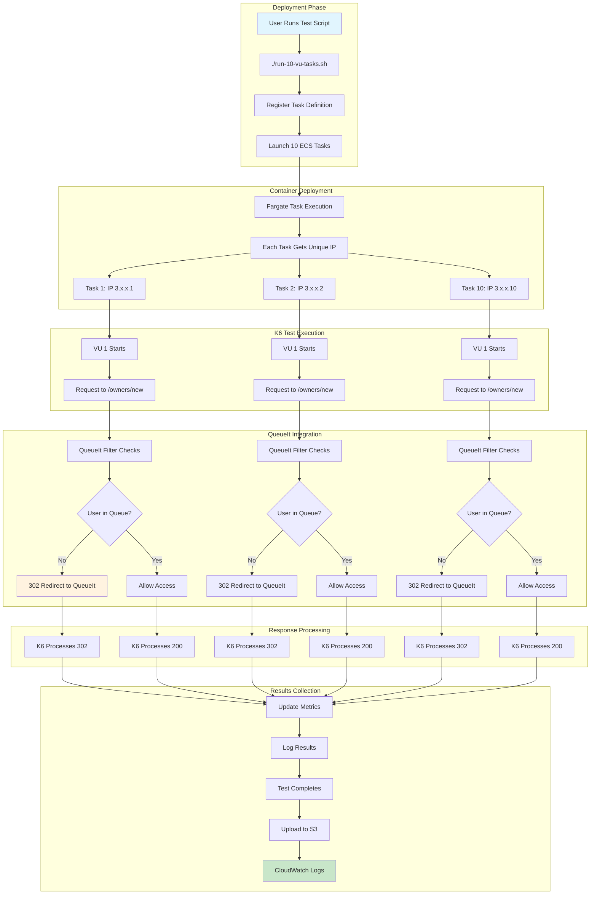
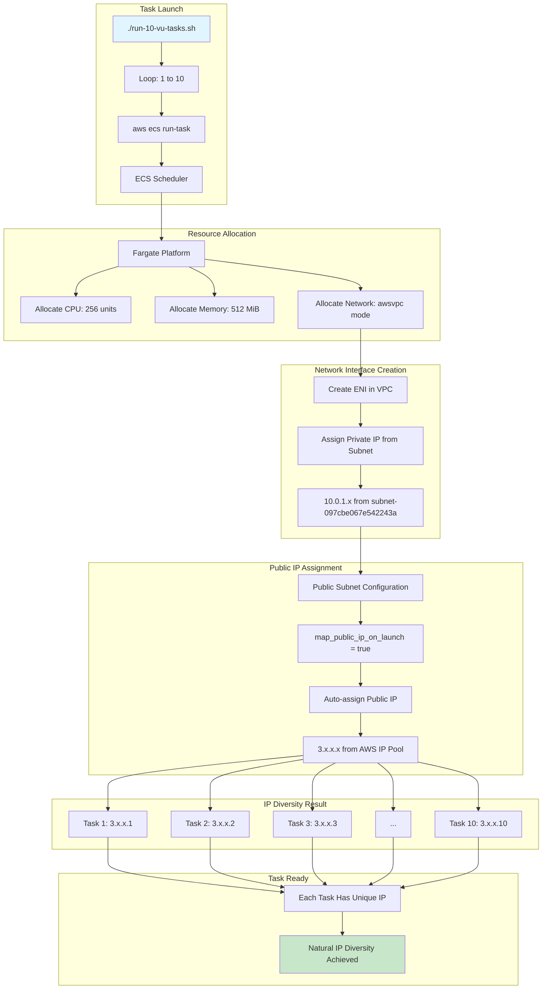
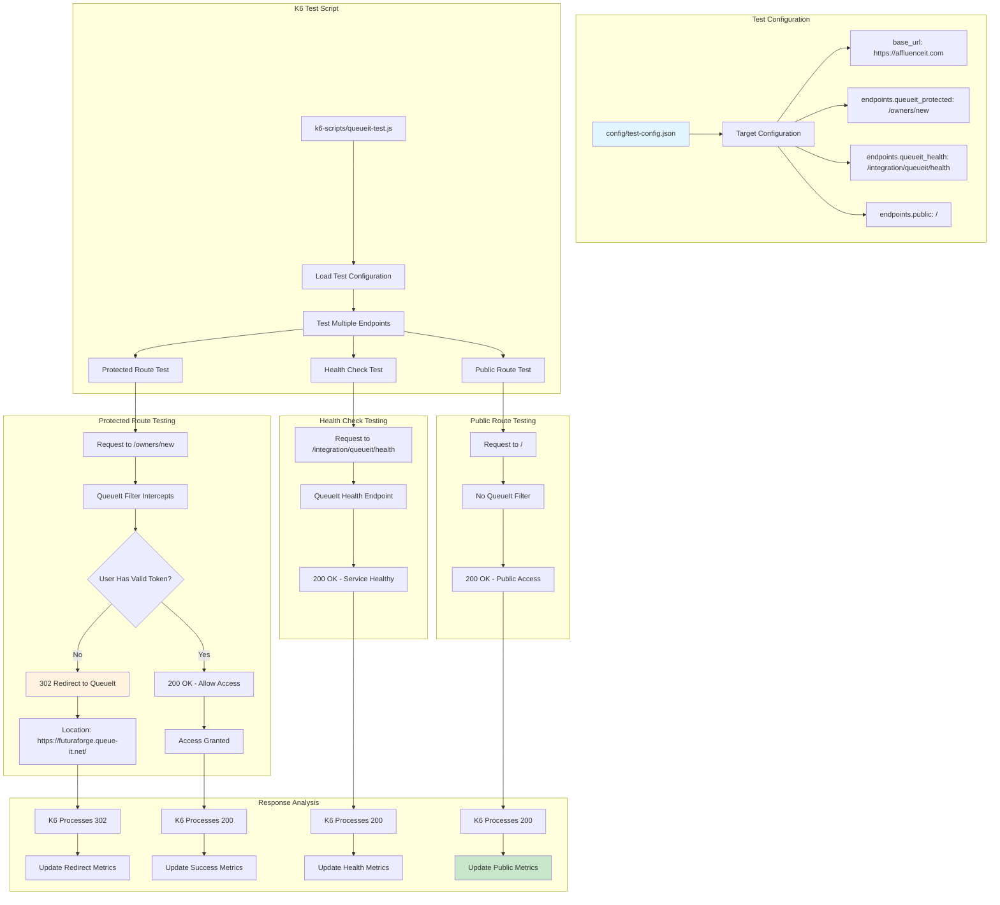
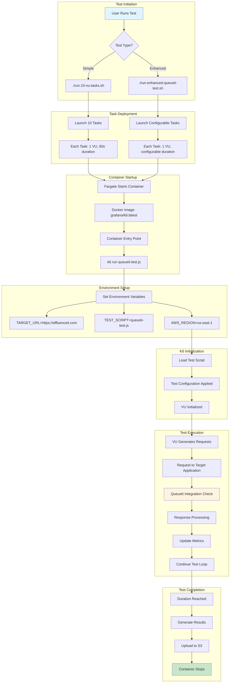
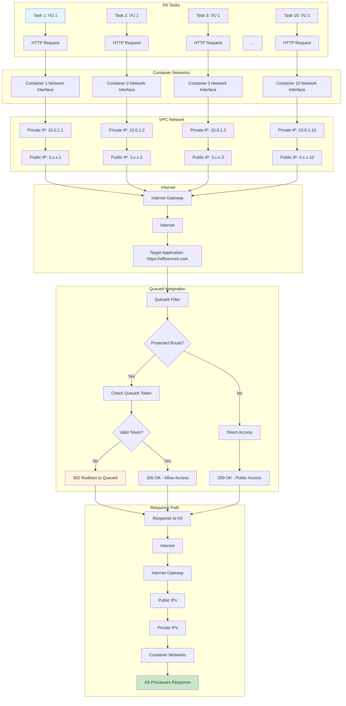
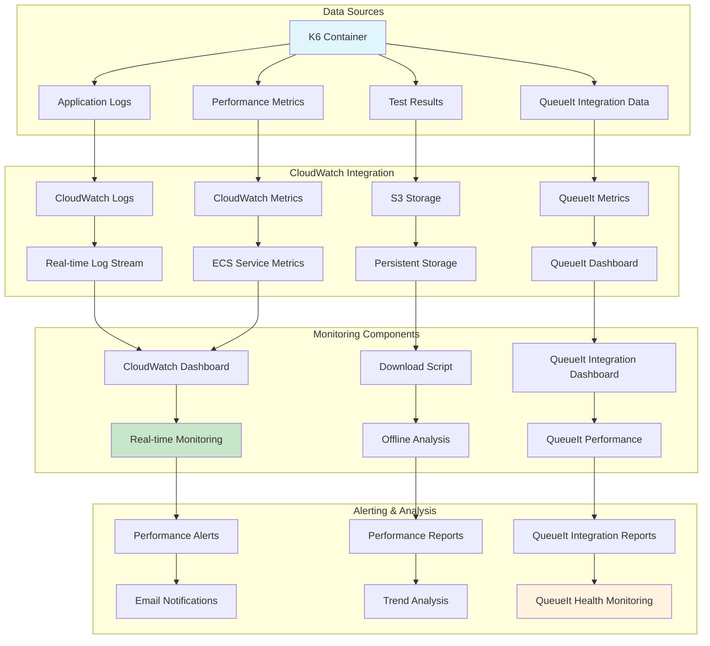

# 🔄 K6 Load Testing with IP Diversity and QueueIt Integration - Flowcharts

## 📋 Table of Contents

1. [Complete Request Flow](#complete-request-flow)
2. [IP Diversity Assignment Process](#ip-diversity-assignment-process)
3. [QueueIt Integration Flow](#queueit-integration-flow)
4. [Test Execution Lifecycle](#test-execution-lifecycle)
5. [Results Processing Pipeline](#results-processing-pipeline)
6. [Network Traffic Flow](#network-traffic-flow)
7. [Data Storage Flow](#data-storage-flow)
8. [Monitoring Flow](#monitoring-flow)

---

## 🔄 Complete Request Flow

### **End-to-End Request Flow with QueueIt Integration**



---

## 🌐 IP Diversity Assignment Process

### **Multiple Tasks IP Assignment Flow**



### **IP Assignment Code Reference**

```bash
#!/bin/bash
# run-10-vu-tasks.sh - IP Diversity Implementation

# Register task definition
aws ecs register-task-definition \
    --cli-input-json file://task-def-single-vu-owners.json \
    --region us-east-1

# Launch 10 tasks for IP diversity
for i in {1..10}; do
    aws ecs run-task \
        --cluster k6-load-test-cluster \
        --task-definition k6-single-vu-task \
        --launch-type FARGATE \
        --network-configuration "awsvpcConfiguration={subnets=[subnet-097cbe067e542243a],securityGroups=[sg-0737d6eb4011e161c],assignPublicIp=ENABLED}" \
        --region us-east-1
done
```

```terraform
# VPC Configuration
resource "aws_vpc" "k6_vpc" {
  cidr_block           = "10.0.0.0/16"
  enable_dns_hostnames = true
  enable_dns_support   = true
}

# Public Subnet with Auto-assign Public IP
resource "aws_subnet" "k6_public_subnet" {
  vpc_id                  = aws_vpc.k6_vpc.id
  cidr_block              = "10.0.1.0/24"
  availability_zone       = "us-east-1a"
  map_public_ip_on_launch = true  # ← Enables auto-assign
}

# ECS Task with awsvpc Network Mode
resource "aws_ecs_task_definition" "k6_task" {
  network_mode             = "awsvpc"  # ← Required for public IP
  requires_compatibilities = ["FARGATE"]
  cpu                      = 256
  memory                   = 512
}
```

---

## 🎯 QueueIt Integration Flow

### **QueueIt Integration Testing Flow**



### **QueueIt Test Script Flow**

```javascript
// k6-scripts/queueit-test.js - QueueIt Integration Testing
import http from 'k6/http';
import { check } from 'k6';

const BASE_URL = __ENV.TARGET_URL || 'https://affluenceit.com';

export default function () {
    // 1. Test Protected Route (QueueIt Integration)
    const protectedResponse = http.get(`${BASE_URL}/owners/new`, {
        redirects: 0  // Don't follow redirects
    });
    
    check(protectedResponse, {
        'protected route returns 302': (r) => r.status === 302,
        'redirects to queue-it': (r) => r.headers.Location && r.headers.Location.includes('queue-it'),
    });
    
    // 2. Test Health Endpoint
    const healthResponse = http.get(`${BASE_URL}/integration/queueit/health`);
    
    check(healthResponse, {
        'health endpoint returns 200': (r) => r.status === 200,
    });
    
    // 3. Test Public Route
    const publicResponse = http.get(`${BASE_URL}/`);
    
    check(publicResponse, {
        'public route returns 200': (r) => r.status === 200,
    });
}
```

---

## 🚀 Test Execution Lifecycle

### **Complete Test Execution Flow**



### **Task Definition Configuration**

```json
{
  "family": "k6-single-vu-task",
  "networkMode": "awsvpc",
  "requiresCompatibilities": ["FARGATE"],
  "cpu": "256",
  "memory": "512",
  "executionRoleArn": "arn:aws:iam::786407478307:role/k6-load-test-ecs-execution-role",
  "taskRoleArn": "arn:aws:iam::786407478307:role/k6-load-test-ecs-task-role",
  "containerDefinitions": [
    {
      "name": "k6",
      "image": "grafana/k6:latest",
      "environment": [
        {"name": "TARGET_URL", "value": "https://affluenceit.com"},
        {"name": "TEST_SCRIPT", "value": "queueit-test.js"}
      ],
      "logConfiguration": {
        "logDriver": "awslogs",
        "options": {
          "awslogs-group": "/ecs/k6-single-vu-task",
          "awslogs-region": "us-east-1",
          "awslogs-stream-prefix": "k6"
        }
      }
    }
  ]
}
```

---

## 📊 Results Processing Pipeline

### **Complete Results Processing Flow**

```mermaid
flowchart TD
    subgraph "Test Completion"
        A[K6 Test Finishes] --> B[Generate Results Files]
        B --> C[Test Metrics]
        B --> D[QueueIt Redirect Data]
        B --> E[Performance Data]
    end
    
    subgraph "Local Processing"
        C --> F[Upload Script Triggers]
        D --> F
        E --> F
        F --> G[Enhanced Test: S3 Upload]
        F --> H[Simple Test: CloudWatch Only]
    end
    
    subgraph "S3 Upload Process"
        G --> I[Create S3 Path]
        I --> J[s3://k6-load-test-results-786407478307/test-results/20250709-114704/]
        J --> K[Upload results.json]
        J --> L[Upload test-summary.json]
        J --> M[Upload k6.log]
    end
    
    subgraph "CloudWatch Integration"
        A --> N[Real-time Log Stream]
        N --> O[CloudWatch Logs]
        O --> P[/ecs/k6-single-vu-task]
        
        A --> Q[Performance Metrics]
        Q --> R[ECS Service Metrics]
        R --> S[CPU Utilization]
        R --> T[Memory Utilization]
    end
    
    subgraph "Monitoring & Analysis"
        S --> U[CloudWatch Dashboard]
        T --> U
        P --> U
        
        K --> V[Download Script]
        L --> V
        M --> V
        V --> W[Local Analysis]
        W --> X[Performance Reports]
        W --> Y[QueueIt Integration Analysis]
    end
    
    style A fill:#e1f5fe
    style Y fill:#c8e6c9
```

### **Results Analysis Flow**

```bash
#!/bin/bash
# scripts/download-logs.sh - Results Processing

# Download latest logs
aws logs get-log-events \
    --log-group-name "/ecs/k6-single-vu-task" \
    --log-stream-name "k6/k6-single-vu/$(aws logs describe-log-streams --log-group-name "/ecs/k6-single-vu-task" --order-by LastEventTime --descending --max-items 1 --query 'logStreams[0].logStreamName' --output text)" \
    --region us-east-1 \
    --output json > k6-scripts/test-logs/k6-latest-logs.json

# Analyze QueueIt integration results
jq '.events[] | select(.message | contains("302"))' k6-scripts/test-logs/k6-latest-logs.json
jq '.events[] | select(.message | contains("queue-it"))' k6-scripts/test-logs/k6-latest-logs.json
```

---

## 🌐 Network Traffic Flow

### **Detailed Network Flow with IP Diversity**



### **Network Configuration Details**

```terraform
# Network Configuration Flow
resource "aws_vpc" "k6_vpc" {
  cidr_block = "10.0.0.0/16"  # ← VPC CIDR
}

resource "aws_subnet" "k6_public_subnet" {
  vpc_id                  = aws_vpc.k6_vpc.id
  cidr_block              = "10.0.1.0/24"  # ← Subnet CIDR
  map_public_ip_on_launch = true  # ← Auto-assign public IP
}

resource "aws_internet_gateway" "k6_igw" {
  vpc_id = aws_vpc.k6_vpc.id  # ← Internet connectivity
}

resource "aws_route_table" "k6_public_rt" {
  vpc_id = aws_vpc.k6_vpc.id
  route {
    cidr_block = "0.0.0.0/0"  # ← All traffic to internet
    gateway_id = aws_internet_gateway.k6_igw.id
  }
}

# ECS Task Network Configuration
resource "aws_ecs_task_definition" "k6_task" {
  network_mode = "awsvpc"  # ← Each task gets ENI
  # ... other configuration
}
```

---

## 💾 Data Storage Flow

### **Complete Data Storage Architecture**

```mermaid
flowchart TD
    subgraph "Data Generation"
        A[K6 Test Execution] --> B[Generate Metrics]
        A --> C[Generate Logs]
        A --> D[Generate Results]
        A --> E[QueueIt Integration Data]
    end
    
    subgraph "Local Storage"
        B --> F[/results/results.json]
        C --> G[/results/k6.log]
        D --> H[/results/test-summary.json]
        E --> I[/results/queueit-analysis.json]
    end
    
    subgraph "S3 Storage"
        F --> J[S3 Upload Script]
        G --> J
        H --> J
        I --> J
        J --> K[S3 Bucket]
        K --> L[Organized Structure]
        L --> M[s3://k6-load-test-results-786407478307/test-results/20250709-114704/]
    end
    
    subgraph "CloudWatch Storage"
        A --> N[Real-time Log Stream]
        N --> O[CloudWatch Logs]
        O --> P[/ecs/k6-single-vu-task]
        
        A --> Q[Performance Metrics]
        Q --> R[CloudWatch Metrics]
        R --> S[ECS Service Metrics]
    end
    
    subgraph "Data Access"
        M --> T[Download Script]
        T --> U[Local Analysis]
        U --> V[Performance Reports]
        U --> W[QueueIt Integration Reports]
        
        P --> X[CloudWatch Dashboard]
        S --> X
    end
    
    style A fill:#e1f5fe
    style W fill:#c8e6c9
    style X fill:#fff3e0
```

### **S3 Storage Structure**

```
s3://k6-load-test-results-786407478307/
├── test-results/
│   ├── 20250709-114704/
│   │   ├── results.json              # Detailed k6 metrics
│   │   ├── test-summary.json         # Test metadata
│   │   ├── k6.log                   # Application logs
│   │   └── queueit-analysis.json    # QueueIt integration data
│   └── 20250709-120000/
│       ├── results.json
│       ├── test-summary.json
│       ├── k6.log
│       └── queueit-analysis.json
```

---

## 📊 Monitoring Flow

### **Complete Monitoring Architecture**



### **Monitoring Configuration**

```terraform
# CloudWatch Log Group
resource "aws_cloudwatch_log_group" "k6_logs" {
  name              = "/ecs/k6-single-vu-task"
  retention_in_days = 7
}

# ECS Task Log Configuration
container_definitions = [
  {
    name = "k6"
    image = "grafana/k6:latest"
    logConfiguration = {
      logDriver = "awslogs"
      options = {
        awslogs-group         = aws_cloudwatch_log_group.k6_logs.name
        awslogs-region        = "us-east-1"
        awslogs-stream-prefix = "k6"
      }
    }
  }
]

# CloudWatch Dashboard
resource "aws_cloudwatch_dashboard" "k6_dashboard" {
  dashboard_name = "k6-load-test-dashboard"
  dashboard_body = jsonencode({
    widgets = [
      {
        type = "metric"
        properties = {
          metrics = [
            ["AWS/ECS", "CPUUtilization"],
            ["AWS/ECS", "MemoryUtilization"]
          ]
        }
      },
      {
        type = "log"
        properties = {
          query = "SOURCE '/ecs/k6-single-vu-task' | fields @timestamp, @message | filter @message like /302/ or @message like /queue-it/"
        }
      }
    ]
  })
}
```

---

## 🎯 Summary

This flowchart document provides:

### **Key Flow Components**
1. **IP Diversity**: Multiple tasks with unique AWS public IPs
2. **QueueIt Integration**: Complete QueueIt testing flow
3. **Test Execution**: Lifecycle from task launch to completion
4. **Network Flow**: Detailed traffic routing with IP diversity
5. **Results Processing**: From local generation to S3 storage
6. **Monitoring**: Real-time metrics and log collection

### **Fargate Role in Each Flow**
- **Resource Allocation**: CPU, memory, and network resources
- **Network Integration**: awsvpc mode with public IP assignment
- **Task Management**: Start, stop, and monitor container execution
- **Logging**: Integration with CloudWatch for real-time monitoring

### **QueueIt Integration Benefits**
- ✅ **Protected Route Testing**: Tests `/owners/new` with QueueIt redirects
- ✅ **Health Check Validation**: Monitors QueueIt health endpoint
- ✅ **Public Route Verification**: Ensures public endpoints remain accessible
- ✅ **IP Diversity**: Each task tests with unique IP address
- ✅ **Realistic Simulation**: Each task represents unique user

### **Benefits of This Architecture**
- ✅ **Natural IP Diversity**: Each task gets unique AWS public IP
- ✅ **QueueIt Integration**: Comprehensive QueueIt testing capabilities
- ✅ **Scalable Design**: Easy to add more tasks or modify flows
- ✅ **Comprehensive Monitoring**: Multiple data collection points
- ✅ **Cost Optimization**: Pay only for actual execution time
- ✅ **Security**: Proper network isolation and access controls

The flowcharts demonstrate how AWS Fargate seamlessly integrates with QueueIt and other AWS services to provide a complete, serverless load testing solution with IP diversity. 