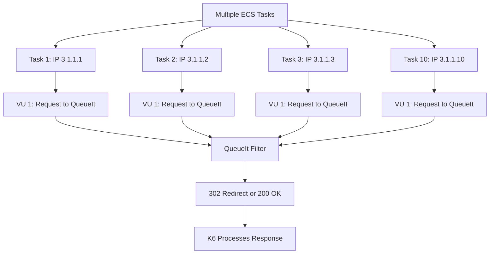
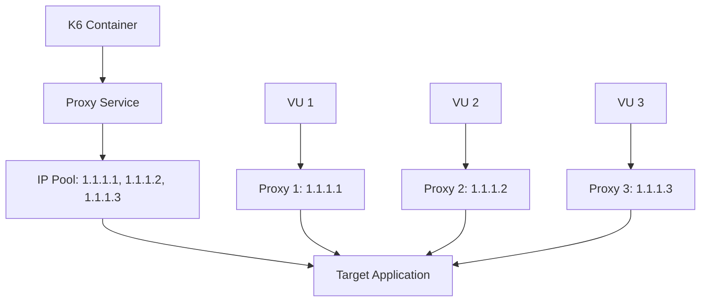
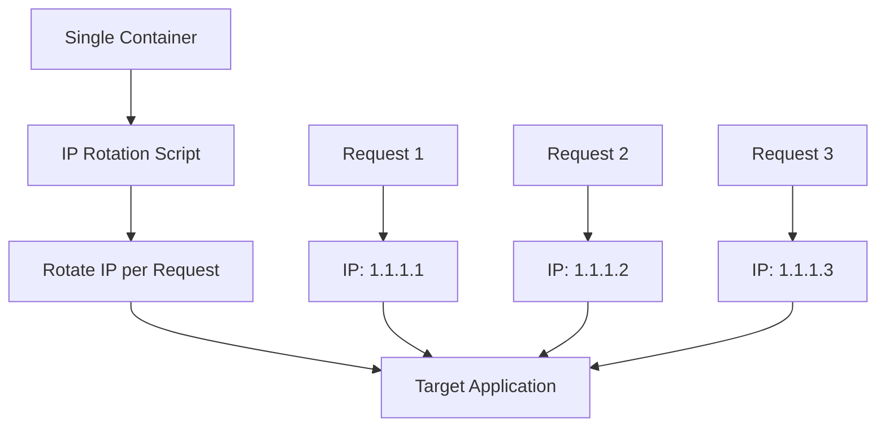
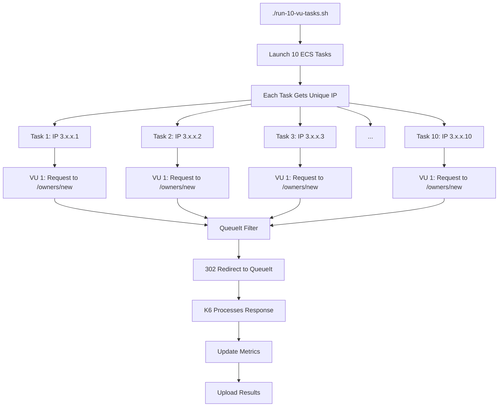
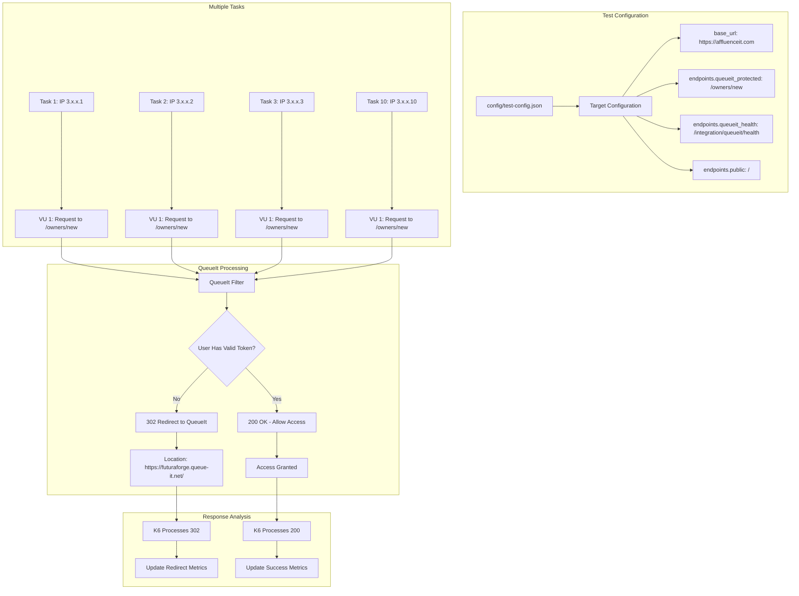

# 🔄 IP Diversity: Detailed Guide

## 📋 Table of Contents

1. [What is IP Diversity?](#what-is-ip-diversity)
2. [Why IP Diversity Matters](#why-ip-diversity-matters)
3. [IP Diversity Methods](#ip-diversity-methods)
4. [Current Project Implementation](#current-project-implementation)
5. [IP Diversity vs IP Rotation](#ip-diversity-vs-ip-rotation)
6. [Technical Implementation](#technical-implementation)
7. [QueueIt Integration](#queueit-integration)
8. [AWS-Based IP Diversity](#aws-based-ip-diversity)
9. [Future: Container-Level IP Rotation](#future-container-level-ip-rotation)
10. [Real-World Examples](#real-world-examples)
11. [Challenges and Limitations](#challenges-and-limitations)
12. [Best Practices](#best-practices)

---

## 🎯 What is IP Diversity?

**IP Diversity** is a technique where different IP addresses are used for outgoing requests by deploying multiple containers or tasks, each with its own unique public IP address.

### **Key Concepts**

- **Static IP Assignment**: Each container gets a unique IP
- **Natural Distribution**: IPs from AWS IP pools
- **Load Distribution**: Spread requests across multiple IPs
- **Rate Limit Bypass**: Avoid per-IP rate limiting
- **QueueIt Integration**: Test queue management with diverse IPs

---

## 🔍 Why IP Diversity Matters

### **Load Testing Scenarios**

| Scenario | **Without IP Diversity** | **With IP Diversity** |
|----------|------------------------|---------------------|
| **Rate Limiting** | ❌ Single IP hits limits quickly | ✅ Multiple IPs bypass limits |
| **QueueIt Testing** | ❌ Limited queue entry points | ✅ Multiple independent sessions |
| **Load Balancer Testing** | ❌ Limited IP diversity | ✅ Tests load balancer with diverse IPs |
| **Security Testing** | ❌ Easy to detect single source | ✅ Harder to detect automated traffic |
| **Realistic Simulation** | ❌ Unrealistic traffic pattern | ✅ Mimics real user behavior |

### **Business Benefits**

1. **More Realistic Testing**: Simulates actual user behavior
2. **Better Performance Data**: Tests how systems handle diverse traffic
3. **Comprehensive Coverage**: Tests rate limiting and security measures
4. **QueueIt Integration**: Tests queue management systems effectively
5. **Cost Effective**: Zero additional cost for IP diversity

---

## 🔄 IP Diversity Methods

### **Method 1: Multiple ECS Tasks (Current)**



**How it works:**
- Each ECS task gets a unique public IP
- AWS automatically assigns different IPs
- Natural IP diversity without external services
- Each task represents independent user session

### **Method 2: Future - Proxy-Based Rotation**



**How it works:**
- Each VU uses a different proxy endpoint
- Proxies have different public IPs
- Requests appear to come from different sources
- More complex but higher IP diversity

### **Method 3: Future - Container-Level Rotation**



**How it works:**
- Single container rotates IPs dynamically
- Uses proxy services or VPN endpoints
- Changes IP during test execution
- Highest complexity but maximum flexibility

---

## 🌐 Current Project Implementation

### **How Our Project Currently Works**



### **Current Implementation Details**

1. **Multiple Tasks**: Each task runs independently with 1 VU
2. **Unique IPs**: Each task gets unique AWS public IP
3. **QueueIt Integration**: Tests protected routes with IP diversity
4. **Cost Effective**: Zero additional cost for IP diversity
5. **Simple Management**: Easy to deploy and monitor

### **Current Configuration**

```bash
#!/bin/bash
# run-10-vu-tasks.sh - Current Implementation

# Register task definition
aws ecs register-task-definition \
    --cli-input-json file://task-def-single-vu-owners.json \
    --region us-east-1

# Launch 10 tasks for IP diversity
for i in {1..10}; do
    aws ecs run-task \
        --cluster k6-load-test-cluster \
        --task-definition k6-single-vu-task \
        --launch-type FARGATE \
        --network-configuration "awsvpcConfiguration={subnets=[subnet-097cbe067e542243a],securityGroups=[sg-0737d6eb4011e161c],assignPublicIp=ENABLED}" \
        --region us-east-1
done
```

```json
{
  "family": "k6-single-vu-task",
  "networkMode": "awsvpc",
  "requiresCompatibilities": ["FARGATE"],
  "cpu": "256",
  "memory": "512",
  "executionRoleArn": "arn:aws:iam::786407478307:role/k6-load-test-ecs-execution-role",
  "taskRoleArn": "arn:aws:iam::786407478307:role/k6-load-test-ecs-task-role",
  "containerDefinitions": [
    {
      "name": "k6",
      "image": "grafana/k6:latest",
      "environment": [
        {"name": "TARGET_URL", "value": "https://affluenceit.com"},
        {"name": "TEST_SCRIPT", "value": "queueit-test.js"}
      ],
      "logConfiguration": {
        "logDriver": "awslogs",
        "options": {
          "awslogs-group": "/ecs/k6-single-vu-task",
          "awslogs-region": "us-east-1",
          "awslogs-stream-prefix": "k6"
        }
      }
    }
  ]
}
```

---

## 🔄 IP Diversity vs IP Rotation

### **IP Diversity (Current Project)**

| Aspect | **Current Implementation** |
|--------|---------------------------|
| **IP Assignment** | Static per container |
| **IP Count** | 1 IP per container |
| **Geographic Distribution** | No (all from same region) |
| **Dynamic Changes** | No (IPs don't change) |
| **Cost** | Low (no additional services) |
| **Complexity** | Low |
| **QueueIt Integration** | Excellent (independent sessions) |

### **IP Rotation (Future)**

| Aspect | **IP Rotation Implementation** |
|--------|------------------------------|
| **IP Assignment** | Dynamic per request/VU |
| **IP Count** | Multiple IPs per container |
| **Geographic Distribution** | Yes (proxy services) |
| **Dynamic Changes** | Yes (IPs change during test) |
| **Cost** | High (proxy services) |
| **Complexity** | High |
| **QueueIt Integration** | Good (but more complex) |

---

## 🛠️ Technical Implementation

### **1. Current: Multiple ECS Tasks**

#### **Architecture**
```
Multiple ECS Tasks
├── Task 1: 1 VU → IP: 3.1.1.1
├── Task 2: 1 VU → IP: 3.1.1.2
├── Task 3: 1 VU → IP: 3.1.1.3
└── Task 10: 1 VU → IP: 3.1.1.10
```

#### **Implementation**
```bash
#!/bin/bash
# Deploy multiple tasks for IP diversity

TASK_COUNT=10
CLUSTER_NAME="k6-load-test-cluster"
TASK_DEFINITION="k6-single-vu-task"

for i in {1..$TASK_COUNT}; do
    echo "Starting task $i of $TASK_COUNT"
    
    aws ecs run-task \
        --cluster $CLUSTER_NAME \
        --task-definition $TASK_DEFINITION \
        --launch-type FARGATE \
        --network-configuration "awsvpcConfiguration={subnets=[subnet-097cbe067e542243a],securityGroups=[sg-0737d6eb4011e161c],assignPublicIp=ENABLED}" \
        --region us-east-1
    
    # Wait between task starts to avoid overwhelming
    sleep 2
done
```

#### **Terraform Configuration**
```terraform
# Multiple tasks with different IPs
resource "aws_ecs_task_definition" "k6_task" {
  family                   = "k6-single-vu-task"
  network_mode             = "awsvpc"
  requires_compatibilities = ["FARGATE"]
  
  # Each task gets unique resources
  cpu    = 256
  memory = 512
  
  # Each task gets unique public IP
  # AWS automatically assigns different IPs
}
```

### **2. Future: Proxy-Based Rotation**

#### **Architecture**
```
K6 Container with Proxy
├── VU 1 → Proxy 1 → IP: 1.1.1.1
├── VU 2 → Proxy 2 → IP: 1.1.1.2
├── VU 3 → Proxy 3 → IP: 1.1.1.3
└── VU N → Proxy N → IP: 1.1.1.N
```

#### **Implementation**
```javascript
// Future: k6 script with proxy rotation
import http from 'k6/http';

const PROXY_LIST = [
    'http://proxy1.service:8080',
    'http://proxy2.service:8080',
    'http://proxy3.service:8080',
    // ... more proxies
];

export default function () {
    // Rotate proxy for each request
    const proxyIndex = __VU % PROXY_LIST.length;
    const proxyUrl = PROXY_LIST[proxyIndex];
    
    const response = http.get('https://affluenceit.com/owners/new', {
        proxy: proxyUrl,
        redirects: 0  // Don't follow redirects for QueueIt testing
    });
}
```

---

## 🎯 QueueIt Integration

### **QueueIt Integration with IP Diversity**



### **QueueIt Test Script**

```javascript
// k6-scripts/queueit-test.js - QueueIt Integration Testing
import http from 'k6/http';
import { check } from 'k6';

const BASE_URL = __ENV.TARGET_URL || 'https://affluenceit.com';

export default function () {
    // 1. Test Protected Route (QueueIt Integration)
    const protectedResponse = http.get(`${BASE_URL}/owners/new`, {
        redirects: 0  // Don't follow redirects
    });
    
    check(protectedResponse, {
        'protected route returns 302': (r) => r.status === 302,
        'redirects to queue-it': (r) => r.headers.Location && r.headers.Location.includes('queue-it'),
    });
    
    // 2. Test Health Endpoint
    const healthResponse = http.get(`${BASE_URL}/integration/queueit/health`);
    
    check(healthResponse, {
        'health endpoint returns 200': (r) => r.status === 200,
    });
    
    // 3. Test Public Route
    const publicResponse = http.get(`${BASE_URL}/`);
    
    check(publicResponse, {
        'public route returns 200': (r) => r.status === 200,
    });
}
```

### **QueueIt Test Scenarios**

1. **Protected Route Testing**
   - Target: `/owners/new`
   - Expected: 302 redirect to QueueIt waiting room
   - Validation: Location header contains "queue-it"
   - IP Diversity: Each task tests independently

2. **Health Check Testing**
   - Target: `/integration/queueit/health`
   - Expected: 200 status code
   - Validation: QueueIt service health
   - IP Diversity: Multiple health checks from different IPs

3. **Public Route Testing**
   - Target: `/`
   - Expected: 200 status code
   - Validation: Public access without QueueIt
   - IP Diversity: Baseline performance from multiple IPs

---

## ☁️ AWS-Based IP Diversity

### **1. Multiple ECS Tasks**

#### **Implementation**
```bash
#!/bin/bash
# Deploy multiple tasks for IP diversity

TASK_COUNT=10
CLUSTER_NAME="k6-load-test-cluster"
TASK_DEFINITION="k6-single-vu-task"

for i in {1..$TASK_COUNT}; do
    echo "Starting task $i of $TASK_COUNT"
    
    aws ecs run-task \
        --cluster $CLUSTER_NAME \
        --task-definition $TASK_DEFINITION \
        --launch-type FARGATE \
        --network-configuration "awsvpcConfiguration={subnets=[subnet-097cbe067e542243a],securityGroups=[sg-0737d6eb4011e161c],assignPublicIp=ENABLED}" \
        --region us-east-1
    
    # Wait between task starts to avoid overwhelming
    sleep 2
done
```

#### **Terraform Configuration**
```terraform
# Multiple tasks with different IPs
resource "aws_ecs_task_definition" "k6_task" {
  family                   = "k6-single-vu-task"
  network_mode             = "awsvpc"
  requires_compatibilities = ["FARGATE"]
  
  # Each task gets unique resources
  cpu    = 256
  memory = 512
  
  # Each task gets unique public IP
  # AWS automatically assigns different IPs
}

# VPC Configuration for public IP assignment
resource "aws_subnet" "k6_public_subnet" {
  vpc_id                  = aws_vpc.k6_vpc.id
  cidr_block              = "10.0.1.0/24"
  availability_zone       = "us-east-1a"
  map_public_ip_on_launch = true  # ← Enables auto-assign
}
```

### **2. Multi-Region Deployment**

#### **Implementation**
```bash
#!/bin/bash
# Multi-region deployment for geographic IP diversity

REGIONS=("us-east-1" "us-west-2" "eu-west-1")

for region in "${REGIONS[@]}"; do
    echo "Deploying to region: $region"
    
    # Deploy infrastructure in each region
    cd terraform/$region
    terraform apply -var="aws_region=$region"
    
    # Run load test in this region
    aws ecs run-task \
        --cluster k6-cluster-$region \
        --task-definition k6-task \
        --launch-type FARGATE \
        --region $region
done
```

#### **Regional IP Distribution**
```
Multi-Region IP Assignment
├── us-east-1: 3.x.x.x range
├── us-west-2: 4.x.x.x range
├── eu-west-1: 5.x.x.x range
└── ap-southeast-1: 6.x.x.x range
```

### **3. NAT Gateway with Multiple IPs**

#### **Implementation**
```terraform
# Multiple NAT Gateways with different IPs
resource "aws_eip" "nat_1" {
  domain = "vpc"
  tags = {
    Name = "nat-eip-1"
  }
}

resource "aws_eip" "nat_2" {
  domain = "vpc"
  tags = {
    Name = "nat-eip-2"
  }
}

resource "aws_nat_gateway" "nat_1" {
  allocation_id = aws_eip.nat_1.id
  subnet_id     = aws_subnet.public_subnet.id
}

resource "aws_nat_gateway" "nat_2" {
  allocation_id = aws_eip.nat_2.id
  subnet_id     = aws_subnet.public_subnet.id
}

# Route tables for different tasks
resource "aws_route_table" "task_route_1" {
  vpc_id = aws_vpc.k6_vpc.id
  
  route {
    cidr_block = "0.0.0.0/0"
    nat_gateway_id = aws_nat_gateway.nat_1.id
  }
}

resource "aws_route_table" "task_route_2" {
  vpc_id = aws_vpc.k6_vpc.id
  
  route {
    cidr_block = "0.0.0.0/0"
    nat_gateway_id = aws_nat_gateway.nat_2.id
  }
}
```

---

## 🔮 Future: Container-Level IP Rotation

### **1. Dynamic IP Assignment**

#### **Implementation**
```javascript
// Future: k6 script with dynamic IP rotation
import http from 'k6/http';

// IP rotation configuration
const IP_ROTATION_ENABLED = __ENV.IP_ROTATION_ENABLED === 'true';
const PROXY_SERVICE_URL = __ENV.PROXY_SERVICE_URL || 'http://proxy-service:8080';

// Setup function for IP rotation
export function setup() {
    if (IP_ROTATION_ENABLED) {
        console.log(`Setting up IP rotation for VU ${__VU}`);
        // Configure proxy for this VU
        const proxyConfig = {
            proxy: `${PROXY_SERVICE_URL}/vu/${__VU}`
        };
        return { proxyConfig };
    }
    return {};
}

// Main test function
export default function (data) {
    const options = {};
    
    if (IP_ROTATION_ENABLED && data.proxyConfig) {
        options.proxy = data.proxyConfig.proxy;
    }
    
    const response = http.get('https://affluenceit.com/owners/new', {
        ...options,
        redirects: 0  // Don't follow redirects for QueueIt testing
    });
    
    check(response, {
        'status is 200 or 302': (r) => r.status === 200 || r.status === 302,
        'response time < 2000ms': (r) => r.timings.duration < 2000,
    });
}
```

### **2. Proxy Rotation Script**

```bash
#!/bin/bash
# rotate-ip.sh (Future)

# Function to rotate IP for each VU
rotate_ip() {
    local vu_id=$1
    
    # Get proxy IP from rotation service
    PROXY_IP=$(curl -s "https://proxy-service.com/rotate?vu=$vu_id")
    
    # Configure proxy for this VU
    export HTTP_PROXY="http://$PROXY_IP:8080"
    export HTTPS_PROXY="http://$PROXY_IP:8080"
    
    echo "VU $vu_id using IP: $PROXY_IP"
}

# Export function for k6 to use
export -f rotate_ip
```

### **3. Enhanced Dockerfile**

```dockerfile
# Enhanced Dockerfile with IP rotation (Future)
FROM grafana/k6:latest

# Install proxy tools
RUN apk add --no-cache curl jq aws-cli

# IP rotation script
COPY rotate-ip.sh /scripts/
COPY k6-scripts/ip-rotation-test.js /scripts/
RUN chmod +x /scripts/rotate-ip.sh

# Create results directory
RUN mkdir -p /results

# Health check
HEALTHCHECK --interval=30s --timeout=10s --start-period=5s --retries=3 \
    CMD curl -f http://localhost:6565/ || exit 1

# Default command
CMD ["/scripts/run-k6-with-upload.sh"]
```

---

## 🌍 Real-World Examples

### **Example 1: QueueIt Load Testing**

#### **Scenario**
- **Target**: Website with QueueIt integration
- **Challenge**: Test queue management with realistic user behavior
- **Solution**: Multiple ECS tasks with IP diversity

#### **Implementation**
```bash
#!/bin/bash
# QueueIt load test with IP diversity

# Deploy 20 tasks for 20 unique IPs
for i in {1..20}; do
    aws ecs run-task \
        --cluster k6-load-test-cluster \
        --task-definition k6-single-vu-task \
        --launch-type FARGATE \
        --network-configuration "awsvpcConfiguration={subnets=[subnet-097cbe067e542243a],securityGroups=[sg-0737d6eb4011e161c],assignPublicIp=ENABLED}" \
        --region us-east-1
done
```

```javascript
// QueueIt test script
import http from 'k6/http';
import { check } from 'k6';

const BASE_URL = __ENV.TARGET_URL || 'https://affluenceit.com';

export default function () {
    // Test protected route (QueueIt integration)
    const protectedResponse = http.get(`${BASE_URL}/owners/new`, {
        redirects: 0  // Don't follow redirects
    });
    
    check(protectedResponse, {
        'protected route returns 302': (r) => r.status === 302,
        'redirects to queue-it': (r) => r.headers.Location && r.headers.Location.includes('queue-it'),
    });
    
    // Test health endpoint
    const healthResponse = http.get(`${BASE_URL}/integration/queueit/health`);
    
    check(healthResponse, {
        'health endpoint returns 200': (r) => r.status === 200,
    });
}
```

### **Example 2: API Rate Limit Testing**

#### **Scenario**
- **Target**: REST API with rate limits
- **Challenge**: Test rate limiting behavior
- **Solution**: Multiple IPs to bypass limits

#### **Implementation**
```bash
#!/bin/bash
# API rate limit testing with multiple IPs

# Deploy 50 tasks for 50 unique IPs
for i in {1..50}; do
    aws ecs run-task \
        --cluster k6-cluster \
        --task-definition k6-api-test \
        --launch-type FARGATE \
        --network-configuration "awsvpcConfiguration={subnets=[subnet-097cbe067e542243a],securityGroups=[sg-0737d6eb4011e161c],assignPublicIp=ENABLED}" \
        --overrides "{\"containerOverrides\":[{\"name\":\"k6\",\"environment\":[{\"name\":\"API_ENDPOINT\",\"value\":\"https://api.example.com/v1\"},{\"name\":\"TASK_INDEX\",\"value\":\"$i\"}]}]}"
done
```

### **Example 3: Geographic Distribution Testing**

#### **Scenario**
- **Target**: CDN-enabled website
- **Challenge**: Test performance from different regions
- **Solution**: Multi-region deployment

#### **Implementation**
```terraform
# Multi-region deployment
locals {
  regions = ["us-east-1", "us-west-2", "eu-west-1", "ap-southeast-1"]
}

resource "aws_ecs_cluster" "k6_cluster" {
  count = length(local.regions)
  
  name = "${var.project_name}-cluster-${local.regions[count.index]}"
  
  setting {
    name  = "containerInsights"
    value = "enabled"
  }
  
  tags = {
    Name = "${var.project_name}-cluster-${local.regions[count.index]}"
    Region = local.regions[count.index]
  }
}
```

---

## ⚠️ Challenges and Limitations

### **1. Technical Challenges**

| Challenge | **Description** | **Solution** |
|-----------|----------------|--------------|
| **Limited IP Count** | Only as many IPs as tasks | Use more tasks or proxy services |
| **Geographic Limitation** | All IPs from same region | Multi-region deployment |
| **Cost Management** | More tasks = more cost | Balance IP diversity vs cost |
| **Complexity** | Managing multiple tasks | Use automation scripts |

### **2. Legal and Ethical Considerations**

| Consideration | **Description** | **Best Practice** |
|---------------|----------------|-------------------|
| **Terms of Service** | Some services prohibit automated traffic | Review and comply with ToS |
| **Rate Limiting** | Respect rate limits even with IP diversity | Use reasonable request rates |
| **Geographic Restrictions** | Some content is region-restricted | Use appropriate geographic IPs |
| **Data Privacy** | Ensure proper data handling | Follow privacy guidelines |

### **3. Performance Impact**

| Impact | **Description** | **Mitigation** |
|--------|----------------|----------------|
| **Resource Usage** | More tasks = more resources | Monitor and optimize |
| **Network Overhead** | Multiple network interfaces | Use efficient task sizing |
| **Management Complexity** | More tasks to monitor | Use automation and monitoring |
| **Cost Increase** | More tasks = higher cost | Balance requirements vs cost |

---

## 🎯 Best Practices

### **1. Start Simple**

```bash
# Start with multiple ECS tasks (easiest)
./run-10-vu-tasks.sh
```

### **2. Scale Gradually**

```bash
# Start with 5 tasks, then scale up
for i in {1..5}; do
    aws ecs run-task --cluster k6-cluster --task-definition k6-task
done

# Later scale to 20 tasks
for i in {1..20}; do
    aws ecs run-task --cluster k6-cluster --task-definition k6-task
done
```

### **3. Monitor Performance**

```javascript
// Monitor IP diversity performance
export function handleSummary(data) {
    return {
        'ip-diversity-performance.json': JSON.stringify({
            response_times: data.metrics.http_req_duration.values,
            error_rates: data.metrics.http_req_failed.values,
            queueit_redirects: data.metrics.http_reqs.values.queueit_redirects
        })
    };
}
```

### **4. Choose Right Method**

| Requirement | **Recommended Method** | **Reason** |
|-------------|----------------------|------------|
| **Basic IP Diversity** | Multiple ECS Tasks | Simple, cost-effective |
| **QueueIt Integration** | Multiple ECS Tasks | Independent sessions |
| **High IP Count** | Future: Proxy Services | 1000+ unique IPs |
| **Geographic Distribution** | Multi-region + Tasks | Global coverage |
| **Cost Sensitivity** | Multiple ECS Tasks | No additional cost |
| **Professional Testing** | Future: Proxy Services | Enterprise-grade |

### **5. Security Considerations**

```terraform
# Secure task configuration
resource "aws_security_group" "k6_sg" {
  name_prefix = "${var.project_name}-k6-sg"
  vpc_id      = aws_vpc.k6_vpc.id

  egress {
    from_port   = 0
    to_port     = 0
    protocol    = "-1"
    cidr_blocks = ["0.0.0.0/0"]
  }

  tags = {
    Name = "${var.project_name}-k6-sg"
  }
}
```

---

## 📊 Summary

### **IP Diversity Methods Comparison**

| Method | **IP Count** | **Cost** | **Complexity** | **Geographic** | **QueueIt** |
|--------|--------------|----------|----------------|----------------|-------------|
| **Multiple ECS Tasks** | 5-50 | Low | Low | No | Excellent |
| **Future: Proxy Services** | 1000+ | High | High | Yes | Good |
| **Multi-Region** | 20-100 | Medium | Medium | Yes | Good |
| **NAT Gateways** | 10-50 | Medium | Medium | No | Good |

### **Recommendations**

1. **Start with Multiple ECS Tasks**: Simple, cost-effective, excellent QueueIt integration
2. **Evaluate Needs**: Monitor rate limiting and IP diversity requirements
3. **Scale to Proxy Services**: Only if high IP diversity is required
4. **Consider Multi-Region**: For geographic distribution needs
5. **Monitor Performance**: Track latency and throughput impact

### **Key Takeaways**

- **IP Diversity** provides static IP assignment per container
- **Current Project** uses IP diversity (multiple tasks = multiple IPs)
- **QueueIt Integration** works excellently with IP diversity
- **Cost Effective**: Zero additional cost for IP diversity
- **Simple Management**: Easy to deploy and monitor
- **Future Ready**: Framework for advanced IP rotation

IP diversity is a powerful technique for realistic load testing with QueueIt integration, providing excellent results with minimal complexity and cost! 🚀 