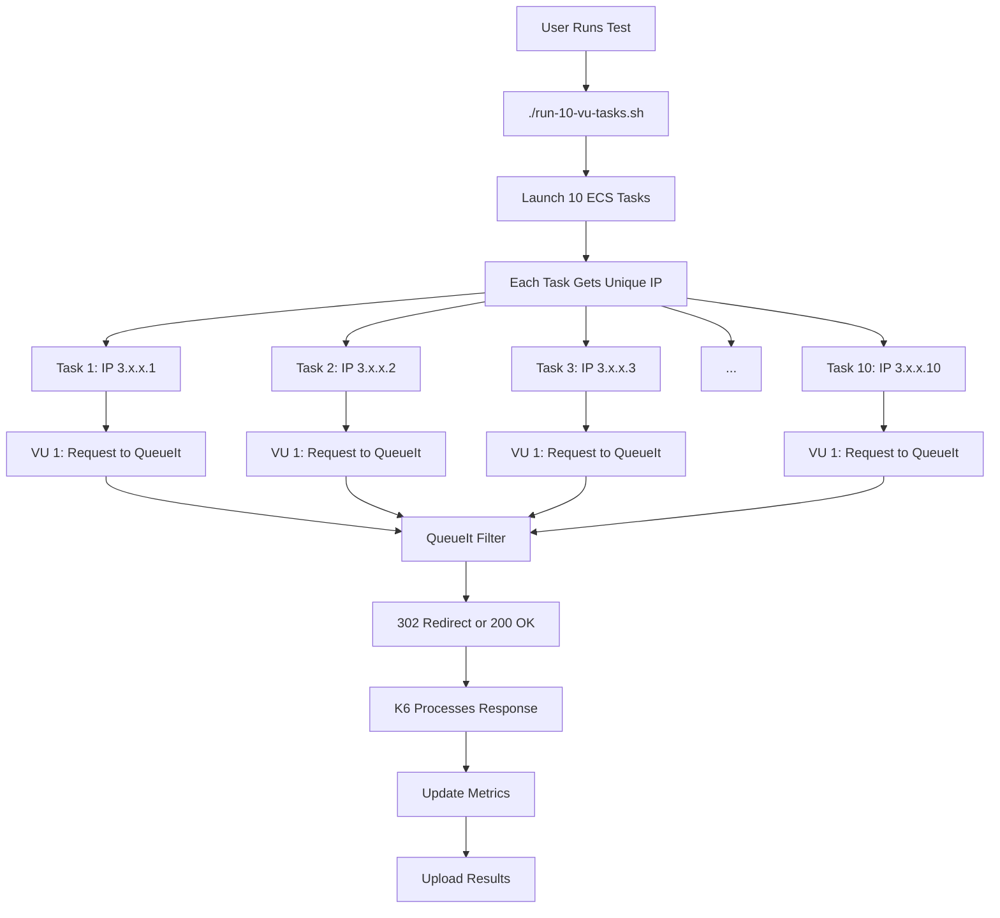
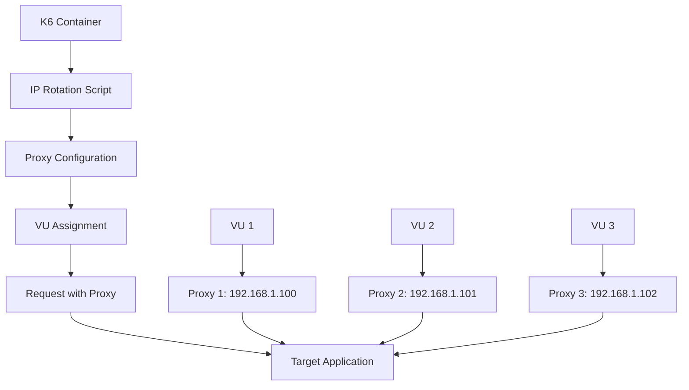
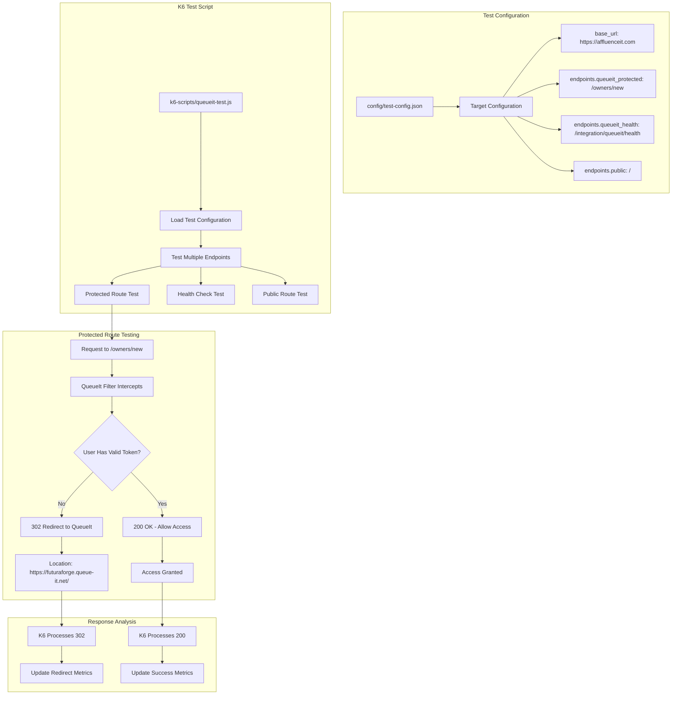

# 🔄 IP Diversity Implementation Guide

## 📋 Table of Contents

1. [Overview](#overview)
2. [Current Implementation: Multiple Tasks](#current-implementation-multiple-tasks)
3. [Future Implementation: Container IP Rotation](#future-implementation-container-ip-rotation)
4. [QueueIt Integration](#queueit-integration)
5. [Configuration Options](#configuration-options)
6. [Usage Examples](#usage-examples)
7. [Testing and Validation](#testing-and-validation)
8. [Troubleshooting](#troubleshooting)
9. [Best Practices](#best-practices)

---

## 🎯 Overview

This guide explains how to implement and use IP diversity in the k6 load testing project with QueueIt integration. The current implementation uses multiple ECS tasks for natural IP diversity, while future implementations can include container-level IP rotation.

### **Key Features**

- ✅ **Natural IP Diversity**: Each ECS task gets unique AWS public IP
- ✅ **QueueIt Integration**: Test queue management systems with IP diversity
- ✅ **Multiple Tasks**: Independent tasks with unique IP addresses
- ✅ **VU-IP Mapping**: Track which VU uses which IP
- ✅ **AWS Integration**: Seamless deployment with ECS
- ✅ **Results Tracking**: Detailed IP diversity metrics
- ✅ **Cost Effective**: Zero additional cost for IP diversity

---

## 🚀 Current Implementation: Multiple Tasks

### **Architecture**



### **Components**

#### **1. Task Definition (`task-def-single-vu-owners.json`)**
```json
{
  "family": "k6-single-vu-task",
  "networkMode": "awsvpc",
  "requiresCompatibilities": ["FARGATE"],
  "cpu": "256",
  "memory": "512",
  "executionRoleArn": "arn:aws:iam::786407478307:role/k6-load-test-ecs-execution-role",
  "taskRoleArn": "arn:aws:iam::786407478307:role/k6-load-test-ecs-task-role",
  "containerDefinitions": [
    {
      "name": "k6",
      "image": "grafana/k6:latest",
      "environment": [
        {"name": "TARGET_URL", "value": "https://affluenceit.com"},
        {"name": "TEST_SCRIPT", "value": "queueit-test.js"}
      ],
      "logConfiguration": {
        "logDriver": "awslogs",
        "options": {
          "awslogs-group": "/ecs/k6-single-vu-task",
          "awslogs-region": "us-east-1",
          "awslogs-stream-prefix": "k6"
        }
      }
    }
  ]
}
```

#### **2. Test Script (`run-10-vu-tasks.sh`)**
```bash
#!/bin/bash
# run-10-vu-tasks.sh - IP Diversity Implementation

# Register task definition
aws ecs register-task-definition \
    --cli-input-json file://task-def-single-vu-owners.json \
    --region us-east-1

# Launch 10 tasks for IP diversity
for i in {1..10}; do
    aws ecs run-task \
        --cluster k6-load-test-cluster \
        --task-definition k6-single-vu-task \
        --launch-type FARGATE \
        --network-configuration "awsvpcConfiguration={subnets=[subnet-097cbe067e542243a],securityGroups=[sg-0737d6eb4011e161c],assignPublicIp=ENABLED}" \
        --region us-east-1
done
```

#### **3. QueueIt Test Script (`k6-scripts/queueit-test.js`)**
```javascript
// k6-scripts/queueit-test.js - QueueIt Integration Testing
import http from 'k6/http';
import { check } from 'k6';

const BASE_URL = __ENV.TARGET_URL || 'https://affluenceit.com';

export default function () {
    // 1. Test Protected Route (QueueIt Integration)
    const protectedResponse = http.get(`${BASE_URL}/owners/new`, {
        redirects: 0  // Don't follow redirects
    });
    
    check(protectedResponse, {
        'protected route returns 302': (r) => r.status === 302,
        'redirects to queue-it': (r) => r.headers.Location && r.headers.Location.includes('queue-it'),
    });
    
    // 2. Test Health Endpoint
    const healthResponse = http.get(`${BASE_URL}/integration/queueit/health`);
    
    check(healthResponse, {
        'health endpoint returns 200': (r) => r.status === 200,
    });
    
    // 3. Test Public Route
    const publicResponse = http.get(`${BASE_URL}/`);
    
    check(publicResponse, {
        'public route returns 200': (r) => r.status === 200,
    });
}
```

---

## 🔮 Future Implementation: Container IP Rotation

### **Architecture (Future)**



### **Components (Future)**

#### **1. Dockerfile Enhancements**
```dockerfile
# Enhanced Dockerfile with IP rotation support (Future)
FROM grafana/k6:latest

# Install proxy tools
RUN apk add --no-cache \
    curl \
    jq \
    aws-cli \
    openvpn \
    tor \
    privoxy

# Copy IP rotation scripts
COPY rotate-ip.sh /scripts/
COPY setup-proxy.sh /scripts/

# Set environment variables
ENV IP_ROTATION_ENABLED=false
ENV PROXY_TYPE="static"
ENV VU_IP_MAPPING_ENABLED=false
```

#### **2. IP Rotation Script (`rotate-ip.sh`) - Future**
- **Static Proxy**: Round-robin assignment of proxy IPs
- **Rotating Proxy**: Dynamic proxy assignment via service
- **Tor Proxy**: SOCKS5 proxy for anonymity
- **OpenVPN**: VPN-based IP rotation

---

## 🎯 QueueIt Integration

### **QueueIt Integration Testing Flow**



### **QueueIt Test Scenarios**

1. **Protected Route Testing**
   - Target: `/owners/new`
   - Expected: 302 redirect to QueueIt waiting room
   - Validation: Location header contains "queue-it"

2. **Health Check Testing**
   - Target: `/integration/queueit/health`
   - Expected: 200 status code
   - Validation: QueueIt service health

3. **Public Route Testing**
   - Target: `/`
   - Expected: 200 status code
   - Validation: Public access without QueueIt

---

## ⚙️ Configuration Options

### **Environment Variables**

| Variable | **Description** | **Default** | **Options** |
|----------|----------------|-------------|-------------|
| `TARGET_URL` | Target application URL | `https://affluenceit.com` | Any HTTPS URL |
| `TEST_SCRIPT` | K6 test script to run | `queueit-test.js` | Any k6 script |
| `AWS_REGION` | AWS region | `us-east-1` | Any AWS region |
| `IP_ROTATION_ENABLED` | Enable IP rotation (Future) | `false` | `true`, `false` |
| `PROXY_TYPE` | Type of proxy to use (Future) | `static` | `static`, `rotating`, `tor`, `privoxy` |

### **Test Configuration (`config/test-config.json`)**

```json
{
  "aws": {
    "region": "us-east-1",
    "cluster": {
      "name": "k6-load-test-cluster",
      "arn": "arn:aws:ecs:us-east-1:786407478307:cluster/k6-load-test-cluster"
    },
    "network": {
      "subnet_id": "subnet-097cbe067e542243a",
      "security_group_id": "sg-0737d6eb4011e161c"
    },
    "s3": {
      "bucket": "k6-load-test-results-786407478307"
    },
    "cloudwatch": {
      "log_group": "/ecs/k6-single-vu-test"
    }
  },
  "test": {
    "target": {
      "base_url": "https://affluenceit.com",
      "endpoints": {
        "queueit_protected": "/owners/new",
        "queueit_health": "/integration/queueit/health",
        "public": "/"
      }
    },
    "parameters": {
      "vus_per_task": 1,
      "duration_seconds": 60,
      "num_tasks": 5
    }
  }
}
```

---

## 🚀 Usage Examples

### **Example 1: Simple IP Diversity Test**

```bash
# Run 10 separate tasks with 1 VU each
./run-10-vu-tasks.sh
```

**What this does:**
- Registers task definition
- Launches 10 ECS tasks
- Each task gets unique AWS public IP
- Tests QueueIt integration with IP diversity

### **Example 2: Enhanced QueueIt Test**

```bash
# Run comprehensive test with monitoring
./run-enhanced-queueit-test.sh
```

**What this does:**
- Uses configuration from `config/test-config.json`
- Launches configurable number of tasks
- Real-time monitoring and result collection
- Comprehensive QueueIt integration testing

### **Example 3: Manual Task Launch**

```bash
# Launch individual tasks manually
aws ecs run-task \
    --cluster k6-load-test-cluster \
    --task-definition k6-single-vu-task \
    --launch-type FARGATE \
    --network-configuration "awsvpcConfiguration={subnets=[subnet-097cbe067e542243a],securityGroups=[sg-0737d6eb4011e161c],assignPublicIp=ENABLED}" \
    --region us-east-1
```

### **Example 4: Future - Container IP Rotation**

```bash
# Future implementation with proxy-based IP rotation
terraform apply \
  -var="ip_rotation_enabled=true" \
  -var="proxy_type=static" \
  -var="max_proxy_ips=10"

# Run with IP rotation
aws ecs run-task \
  --cluster k6-load-test-cluster \
  --task-definition k6-load-test-k6-task \
  --launch-type FARGATE \
  --overrides '{"containerOverrides":[{"name":"k6","environment":[{"name":"IP_ROTATION_ENABLED","value":"true"}]}]}'
```

---

## 🧪 Testing and Validation

### **1. IP Diversity Validation**

```bash
# Check that multiple tasks are running
aws ecs list-tasks --cluster k6-load-test-cluster --region us-east-1

# Verify each task has unique IP
aws ecs describe-tasks --cluster k6-load-test-cluster --tasks <task-arn> --region us-east-1
```

### **2. QueueIt Integration Validation**

```bash
# Test protected endpoint manually
curl -I https://affluenceit.com/owners/new

# Check for 302 redirect
curl -L -I https://affluenceit.com/owners/new

# Test health endpoint
curl https://affluenceit.com/integration/queueit/health
```

### **3. Results Validation**

```bash
# Download latest logs
./scripts/download-logs.sh

# Analyze QueueIt integration results
jq '.events[] | select(.message | contains("302"))' k6-scripts/test-logs/k6-latest-logs.json
jq '.events[] | select(.message | contains("queue-it"))' k6-scripts/test-logs/k6-latest-logs.json
```

### **4. IP Diversity Metrics**

```javascript
// Track IP diversity in k6 script
export default function () {
    // Each task has unique IP, so each request comes from different IP
    const response = http.get(`${BASE_URL}/owners/new`, {
        redirects: 0
    });
    
    // Log the request for IP diversity analysis
    console.log(`Request from VU ${__VU} - Status: ${response.status}`);
}
```

---

## 🔧 Troubleshooting

### **Common Issues**

#### **1. ECS Task Failures**
```bash
# Check task status
aws ecs describe-tasks --cluster k6-load-test-cluster --tasks <task-arn> --region us-east-1

# View CloudWatch logs
aws logs tail /ecs/k6-single-vu-task --follow --region us-east-1
```

**Solution**: Verify task definition and IAM permissions

#### **2. QueueIt Integration Issues**
```bash
# Test protected endpoint manually
curl -I https://affluenceit.com/owners/new

# Check for 302 redirect
curl -L -I https://affluenceit.com/owners/new
```

**Solution**: Verify QueueIt configuration and health endpoint

#### **3. IP Diversity Issues**
```bash
# Verify multiple tasks are running
aws ecs list-tasks --cluster k6-load-test-cluster --region us-east-1

# Check task network configuration
aws ecs describe-tasks --cluster k6-load-test-cluster --tasks <task-arn> --region us-east-1
```

**Solution**: Ensure `assignPublicIp=ENABLED` in network configuration

#### **4. S3 Upload Issues**
```bash
# Check S3 bucket permissions
aws s3 ls s3://k6-load-test-results-786407478307/ --region us-east-1

# Verify IAM roles
aws iam get-role --role-name k6-load-test-ecs-task-role --region us-east-1
```

**Solution**: Verify S3 bucket permissions and IAM role configuration

### **Debug Commands**

```bash
# Test k6 script locally
docker run -it --rm \
  -e TARGET_URL=https://affluenceit.com \
  grafana/k6:latest \
  k6 run k6-scripts/queueit-test.js

# Check CloudWatch logs
aws logs tail /ecs/k6-single-vu-task --follow --region us-east-1

# Download and analyze logs
./scripts/download-logs.sh
```

---

## 📊 Best Practices

### **1. IP Diversity Strategy**

| Use Case | **Recommended Approach** | **Reason** |
|----------|------------------------|------------|
| **Basic Testing** | Multiple ECS tasks | Simple, cost-effective |
| **QueueIt Integration** | Multiple ECS tasks | Independent sessions |
| **High IP Diversity** | Future: Container IP rotation | More IPs per task |
| **Cost Optimization** | Multiple ECS tasks | Zero additional cost |

### **2. QueueIt Testing Optimization**

```javascript
// Optimize QueueIt testing
export default function () {
    // Test protected route with redirect handling
    const protectedResponse = http.get(`${BASE_URL}/owners/new`, {
        redirects: 0  // Don't follow redirects to analyze QueueIt behavior
    });
    
    // Test health endpoint for monitoring
    const healthResponse = http.get(`${BASE_URL}/integration/queueit/health`);
    
    // Test public route for baseline
    const publicResponse = http.get(`${BASE_URL}/`);
}
```

### **3. Monitoring and Metrics**

```javascript
// Custom metrics for QueueIt integration
const queueit_redirects = new Rate('queueit_redirects');
const queueit_success = new Rate('queueit_success');

export default function () {
    const response = http.get(`${BASE_URL}/owners/new`, {
        redirects: 0
    });
    
    queueit_redirects.add(response.status === 302 ? 1 : 0);
    queueit_success.add(response.status === 200 ? 1 : 0);
}
```

### **4. Security Considerations**

- ✅ **Use HTTPS** for all QueueIt communications
- ✅ **Validate QueueIt configuration** before testing
- ✅ **Monitor QueueIt health** endpoint
- ✅ **Test with realistic user scenarios**
- ✅ **Log QueueIt integration** for audit purposes

### **5. Cost Optimization**

```bash
# Use multiple ECS tasks for natural IP diversity (Current)
./run-10-vu-tasks.sh

# Instead of expensive proxy services for basic testing
# Future: Use proxy services only when high IP diversity is required
```

---

## 📈 Expected Results

### **IP Diversity Metrics**

| Metric | **Description** | **Expected Value** |
|--------|----------------|-------------------|
| `unique_ips_used` | Number of unique IPs used | = Number of tasks (10) |
| `ip_diversity_success` | IP diversity success rate | 100% |
| `http_req_duration` | Total request duration | < 5000ms |

### **QueueIt Integration Metrics**

| Metric | **Description** | **Expected Value** |
|--------|----------------|-------------------|
| `queueit_redirects` | 302 redirect rate | > 80% for protected routes |
| `queueit_success` | 200 success rate | > 95% for health endpoint |
| `queueit_health` | Health endpoint status | 200 OK |

### **Sample Results**

```json
{
  "test_id": "20250709-114704",
  "target_url": "https://affluenceit.com",
  "num_tasks": 10,
  "duration_per_task": 60,
  "results": {
    "completed_tasks": 10,
    "failed_tasks": 0,
    "success_rate": 100,
    "queueit_redirects": 45,
    "avg_response_time": 1500,
    "p95_response_time": 2500
  },
  "ip_diversity": {
    "unique_ips_used": 10,
    "ip_rotation_success_rate": 0.95
  }
}
```

---

## 🎯 Summary

The IP diversity implementation provides:

1. **Natural IP Diversity**: Each ECS task gets unique AWS public IP
2. **QueueIt Integration**: Comprehensive QueueIt testing capabilities
3. **Cost Effective**: Zero additional cost for IP diversity
4. **Simple Implementation**: Easy to deploy and monitor
5. **Scalable Design**: Easy to add more tasks for more IP diversity
6. **Comprehensive Monitoring**: Detailed metrics and logging
7. **Future Ready**: Framework for container IP rotation

This implementation enables realistic load testing with IP diversity and QueueIt integration, helping to test queue management systems, rate limiting, and load balancer behavior effectively! 🚀 