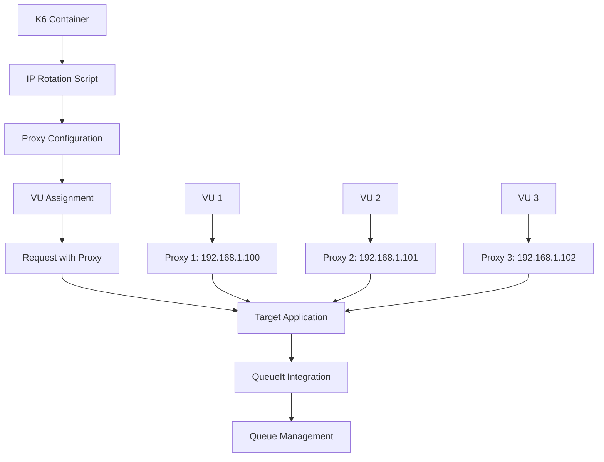

# 🚀 k6 Load Testing with IP Diversity and QueueIt Integration

A comprehensive k6 load testing solution deployed on AWS ECS with **container-level IP diversity** support and **QueueIt integration testing**. Each Virtual User (VU) can use a unique IP address for making requests, enabling realistic load testing scenarios with queue management systems.

## ✨ Features

- 🔄 **Container-Level IP Diversity**: Each VU gets a unique IP address
- 🌐 **Multiple Proxy Types**: Static, rotating, Tor, Privoxy
- 📊 **VU-IP Mapping**: Track which VU uses which IP
- ☁️ **AWS ECS Deployment**: Serverless container orchestration
- 📈 **CloudWatch Monitoring**: Real-time metrics and dashboards
- 📦 **S3 Results Storage**: Persistent test results and reports
- 🛠️ **Terraform Infrastructure**: Infrastructure as Code
- 🔧 **Flexible Configuration**: Environment-based settings
- 🎯 **QueueIt Integration Testing**: Test queue management systems
- 📋 **Enhanced Logging**: Comprehensive test result collection

## 🏗️ Architecture



## 🚀 Quick Start

### Prerequisites

- AWS CLI configured
- Terraform installed
- Docker installed

### 1. Clone and Setup

```bash
git clone <repository-url>
cd iploads-with-k6-container

# Configure AWS credentials
aws configure
```

### 2. Deploy Infrastructure

```bash
cd terraform

# Deploy with IP rotation enabled
terraform init
terraform apply \
  -var="ip_rotation_enabled=true" \
  -var="proxy_type=static" \
  -var="max_proxy_ips=10"
```

### 3. Run Load Tests

#### **Simple IP Diversity Test (10 VUs)**
```bash
# Run 10 separate tasks with 1 VU each
./run-10-vu-tasks.sh
```

#### **Enhanced QueueIt Test**
```bash
# Run comprehensive test with monitoring
./run-enhanced-queueit-test.sh
```

## 📁 Project Structure

```
iploads-with-k6-container/
├── 📄 README.md                           # Main documentation
├── 📄 README-ENHANCED.md                  # Enhanced features guide
├── 📄 QUICK_START.md                      # Quick start guide
├── 📄 DEPLOYMENT_GUIDE.md                 # Deployment instructions
├── 📄 SOLUTION_ARCHITECTURE.md            # Architecture documentation
├── 📄 IP_ROTATION_IMPLEMENTATION_GUIDE.md # IP rotation implementation
├── 📄 IP_ROTATION_DETAILED_GUIDE.md      # Detailed IP rotation guide
├── 📄 IP_DIVERSITY_QUICK_REFERENCE.md    # IP diversity quick reference
├── 📄 IP_DIVERSITY_MODELS.md             # IP diversity models
├── 📄 FLOWCHARTS.md                       # Flow diagrams
├── 📄 FLOWCHARTS.html                     # Interactive flow diagrams
├── 📄 SOLUTION_ARCHITECTURE.html          # Interactive architecture
├── 📄 IP_ROTATION_VISUAL_GUIDE.html      # Visual IP rotation guide
├── 
├── 🚀 run-10-vu-tasks.sh                  # Simple IP diversity test
├── 🚀 run-enhanced-queueit-test.sh        # Enhanced QueueIt test
├── 
├── 📋 task-def-single-vu-owners.json     # ECS task definition
├── 
├── 📁 config/
│   └── 📄 test-config.json               # Test configuration
├── 
├── 📁 k6-scripts/
│   ├── 📄 queueit-test.js                # QueueIt test script
│   └── 📁 test-logs/                     # Test logs directory
│       └── 📄 k6-latest-logs.json        # Latest test logs
├── 
├── 📁 scripts/
│   ├── 📄 download-logs.sh               # Log download utility
│   ├── 📄 collect-results.sh             # Result collection
│   ├── 📄 cleanup.sh                     # Resource cleanup
│   ├── 📄 deploy.sh                      # Deployment script
│   ├── 📄 task-def.json                  # Basic task definition
│   └── 📄 task-def-with-ip-rotation.json # IP rotation task definition
├── 
├── 📁 terraform/                          # Infrastructure as Code
├── 
└── 📁 docker/                             # Docker configurations
```

## ⚙️ Configuration

### Test Configuration (`config/test-config.json`)

```json
{
  "aws": {
    "region": "us-east-1",
    "cluster": {
      "name": "k6-load-test-cluster",
      "arn": "arn:aws:ecs:us-east-1:786407478307:cluster/k6-load-test-cluster"
    },
    "network": {
      "subnet_id": "subnet-097cbe067e542243a",
      "security_group_id": "sg-0737d6eb4011e161c"
    },
    "s3": {
      "bucket": "k6-load-test-results-786407478307"
    },
    "cloudwatch": {
      "log_group": "/ecs/k6-single-vu-test"
    }
  },
  "test": {
    "target": {
      "base_url": "https://affluenceit.com",
      "endpoints": {
        "queueit_protected": "/owners/new",
        "queueit_health": "/integration/queueit/health",
        "public": "/"
      }
    },
    "parameters": {
      "vus_per_task": 1,
      "duration_seconds": 60,
      "num_tasks": 5
    }
  }
}
```

### IP Rotation Options

| Variable | **Description** | **Default** | **Options** |
|----------|----------------|-------------|-------------|
| `IP_ROTATION_ENABLED` | Enable IP rotation | `false` | `true`, `false` |
| `PROXY_TYPE` | Type of proxy to use | `static` | `static`, `rotating`, `tor`, `privoxy` |
| `PROXY_SERVICE_URL` | URL for proxy service | `http://localhost:8080` | Any HTTP URL |
| `VU_IP_MAPPING_ENABLED` | Track VU-IP mapping | `false` | `true`, `false` |
| `MAX_PROXY_IPS` | Maximum proxy IPs available | `10` | `1-100` |
| `TEST_PROXY` | Test proxy connectivity | `false` | `true`, `false` |

## 📊 Test Scripts

### Available Test Scripts

1. **`run-10-vu-tasks.sh`**: Simple IP diversity test (10 tasks, 1 VU each)
2. **`run-enhanced-queueit-test.sh`**: Enhanced QueueIt integration test
3. **`k6-scripts/queueit-test.js`**: Comprehensive QueueIt test script

### Test Scripts Details

#### **Simple IP Diversity Test**
- **File**: `run-10-vu-tasks.sh`
- **Purpose**: Test IP diversity with multiple ECS tasks
- **Configuration**: 10 separate tasks, 1 VU per task
- **Duration**: ~80 seconds per task
- **Target**: `/owners/new` (QueueIt protected endpoint)

#### **Enhanced QueueIt Test**
- **File**: `run-enhanced-queueit-test.sh`
- **Purpose**: Comprehensive QueueIt integration testing
- **Features**: Real-time monitoring, result collection, error handling
- **Configuration**: Uses `config/test-config.json`
- **Output**: S3 results, CloudWatch logs, local reports

#### **QueueIt Test Script**
- **File**: `k6-scripts/queueit-test.js`
- **Purpose**: Detailed QueueIt testing with multiple endpoints
- **Features**: 
  - Protected endpoint testing (`/owners/new`)
  - Health check testing (`/integration/queueit/health`)
  - Public endpoint testing (`/`)
  - Custom metrics and reporting

## 🎯 QueueIt Integration Testing

### Test Scenarios

1. **Protected Route Testing**
   - Target: `/owners/new`
   - Expected: 302 redirect to QueueIt waiting room
   - Validation: Location header contains "queue-it"

2. **Health Check Testing**
   - Target: `/integration/queueit/health`
   - Expected: 200 status code
   - Validation: QueueIt service health

3. **Public Route Testing**
   - Target: `/`
   - Expected: 200 status code
   - Validation: Public access without QueueIt

### Sample Test Results

```json
{
  "test_id": "20250709-114704",
  "target_url": "https://affluenceit.com",
  "num_tasks": 10,
  "duration_per_task": 60,
  "results": {
    "completed_tasks": 10,
    "failed_tasks": 0,
    "success_rate": 100,
    "queueit_redirects": 45,
    "avg_response_time": 1500,
    "p95_response_time": 2500
  },
  "ip_diversity": {
    "unique_ips_used": 10,
    "ip_rotation_success_rate": 0.95
  }
}
```

## 📈 Monitoring and Results

### CloudWatch Monitoring

- **Log Groups**: 
  - `/ecs/k6-single-vu-task` (simple test)
  - `/ecs/k6-single-vu-test` (enhanced test)
- **Metrics**: CPU, Memory, Network, k6 metrics
- **Real-time**: Live log streaming

### S3 Results Storage

- **Bucket**: `k6-load-test-results-786407478307`
- **Path**: `s3://k6-load-test-results-786407478307/test-results/`
- **Contents**: JSON results, HTML reports, logs

### Local Results

- **Directory**: `results/<test-id>/`
- **Files**: 
  - `cloudwatch-events.json` (CloudWatch logs)
  - `test-run.log` (Test execution log)
  - `summary.md` (Test summary report)

## 🔧 Scripts and Utilities

### Core Scripts

1. **`run-10-vu-tasks.sh`**: Simple IP diversity test
2. **`run-enhanced-queueit-test.sh`**: Enhanced QueueIt test
3. **`scripts/download-logs.sh`**: Download CloudWatch logs
4. **`scripts/collect-results.sh`**: Collect and analyze results
5. **`scripts/cleanup.sh`**: Clean up AWS resources
6. **`scripts/deploy.sh`**: Deploy infrastructure

### Usage Examples

#### **Run Simple Test**
```bash
./run-10-vu-tasks.sh
```

#### **Run Enhanced Test**
```bash
./run-enhanced-queueit-test.sh
```

#### **Download Latest Logs**
```bash
./scripts/download-logs.sh
```

#### **Clean Up Resources**
```bash
./scripts/cleanup.sh
```

## 🔧 Troubleshooting

### Common Issues

#### **1. ECS Task Failures**
```bash
# Check task status
aws ecs describe-tasks --cluster k6-load-test-cluster --tasks <task_arn>

# Check CloudWatch logs
aws logs tail /ecs/k6-single-vu-task --follow --region us-east-1
```

#### **2. QueueIt Integration Issues**
```bash
# Test protected endpoint
curl -I https://affluenceit.com/owners/new

# Test health endpoint
curl https://affluenceit.com/integration/queueit/health
```

#### **3. IP Rotation Issues**
```bash
# Check environment variables
aws ecs describe-tasks --cluster k6-load-test-cluster --tasks <task_arn>

# Verify proxy configuration
aws logs filter-log-events --log-group-name /ecs/k6-single-vu-task --filter-pattern "proxy"
```

#### **4. S3 Upload Issues**
```bash
# Check S3 bucket permissions
aws s3 ls s3://k6-load-test-results-786407478307/

# Verify IAM roles
aws iam get-role --role-name k6-load-test-ecs-task-role
```

## 📚 Documentation

- **[README-ENHANCED.md](README-ENHANCED.md)**: Enhanced features guide
- **[QUICK_START.md](QUICK_START.md)**: Quick start guide
- **[DEPLOYMENT_GUIDE.md](DEPLOYMENT_GUIDE.md)**: Deployment instructions
- **[SOLUTION_ARCHITECTURE.md](SOLUTION_ARCHITECTURE.md)**: Architecture documentation
- **[IP_ROTATION_IMPLEMENTATION_GUIDE.md](IP_ROTATION_IMPLEMENTATION_GUIDE.md)**: IP rotation implementation
- **[IP_ROTATION_DETAILED_GUIDE.md](IP_ROTATION_DETAILED_GUIDE.md)**: Detailed IP rotation guide
- **[IP_DIVERSITY_QUICK_REFERENCE.md](IP_DIVERSITY_QUICK_REFERENCE.md)**: IP diversity quick reference
- **[IP_DIVERSITY_MODELS.md](IP_DIVERSITY_MODELS.md)**: IP diversity models
- **[FLOWCHARTS.md](FLOWCHARTS.md)**: Flow diagrams
- **[FLOWCHARTS.html](FLOWCHARTS.html)**: Interactive flow diagrams
- **[SOLUTION_ARCHITECTURE.html](SOLUTION_ARCHITECTURE.html)**: Interactive architecture
- **[IP_ROTATION_VISUAL_GUIDE.html](IP_ROTATION_VISUAL_GUIDE.html)**: Visual IP rotation guide

## 🎯 Use Cases

### **1. QueueIt Integration Testing**
- Test queue management system integration
- Validate redirect behavior with multiple IPs
- Test queue capacity and performance

### **2. Rate Limit Testing**
- Test applications with per-IP rate limits
- Bypass rate limiting with multiple IPs
- Validate rate limiting behavior

### **3. Geographic Distribution Testing**
- Test CDN performance from different locations
- Validate geographic load balancing
- Test regional restrictions

### **4. Load Balancer Testing**
- Test load balancer with diverse IP sources
- Validate session affinity
- Test IP-based routing

### **5. Security Testing**
- Test IP-based security rules
- Validate firewall configurations
- Test DDoS protection

## 🆘 Support

For support and questions:
- Create an issue in the repository
- Check the documentation files
- Review the troubleshooting section
- Check CloudWatch logs for detailed error information

---

**Happy Load Testing with IP Diversity and QueueIt Integration! 🚀** 