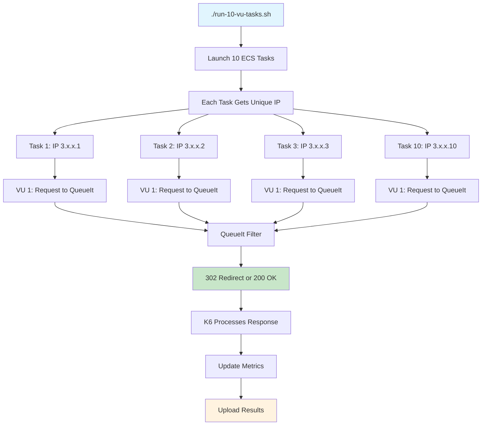
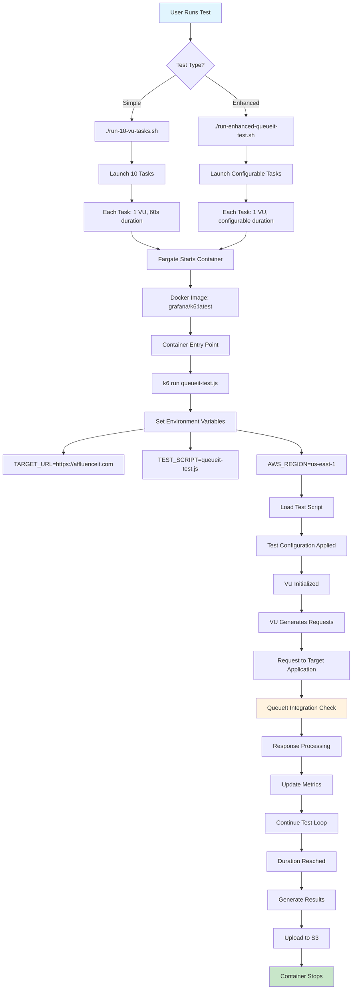
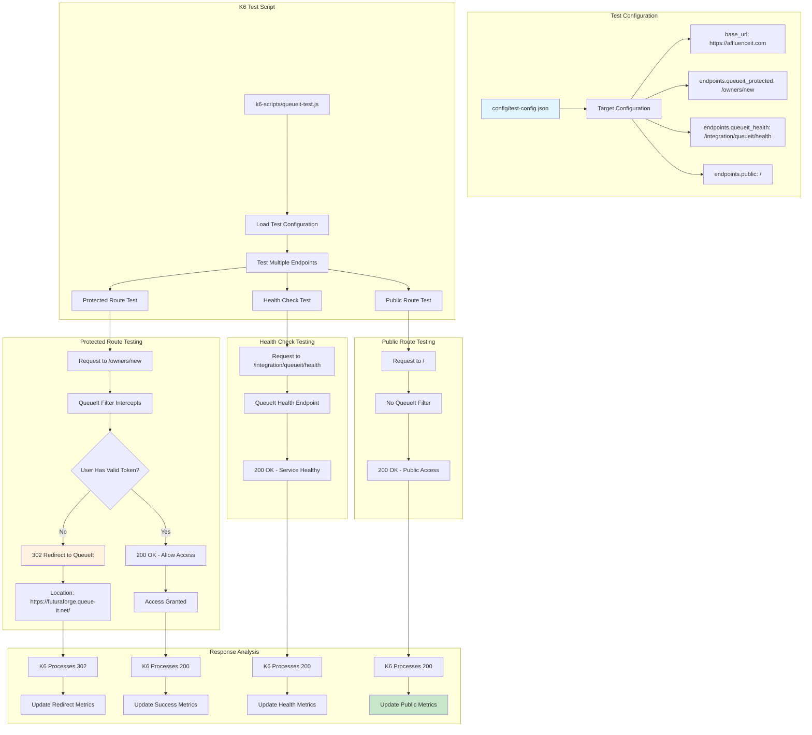
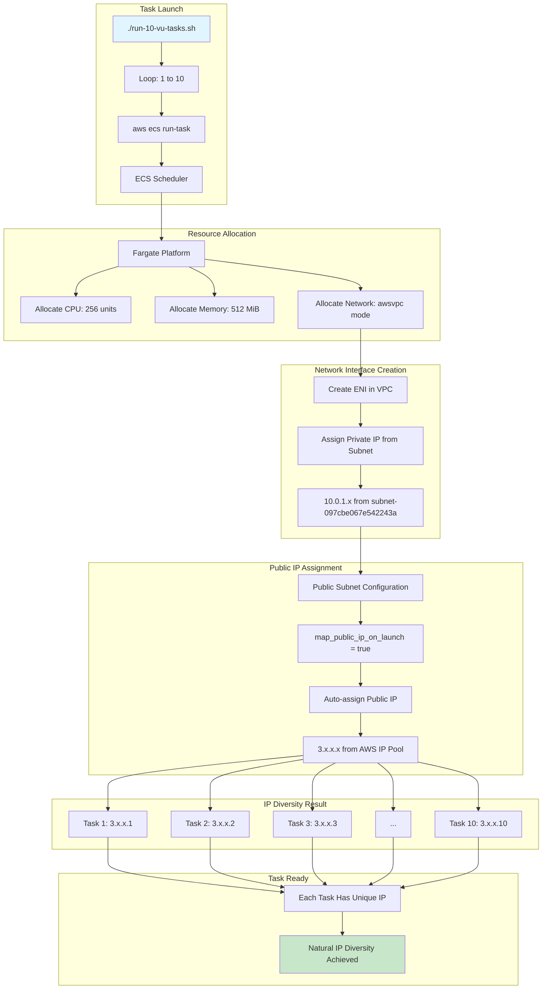
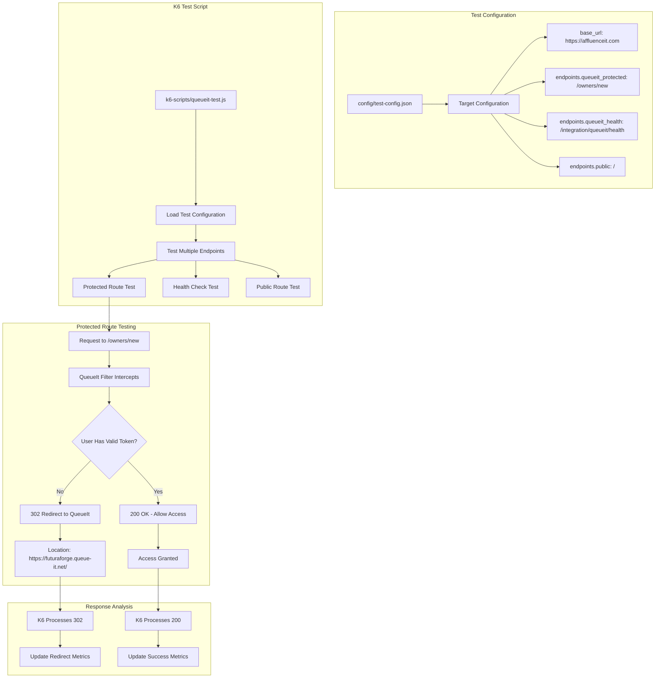
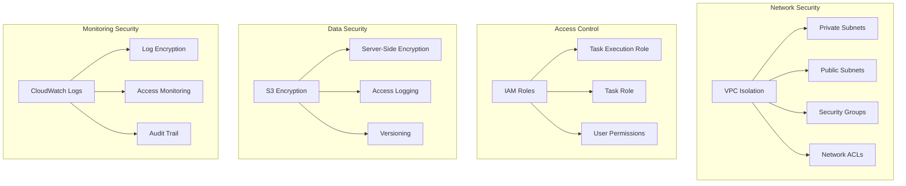
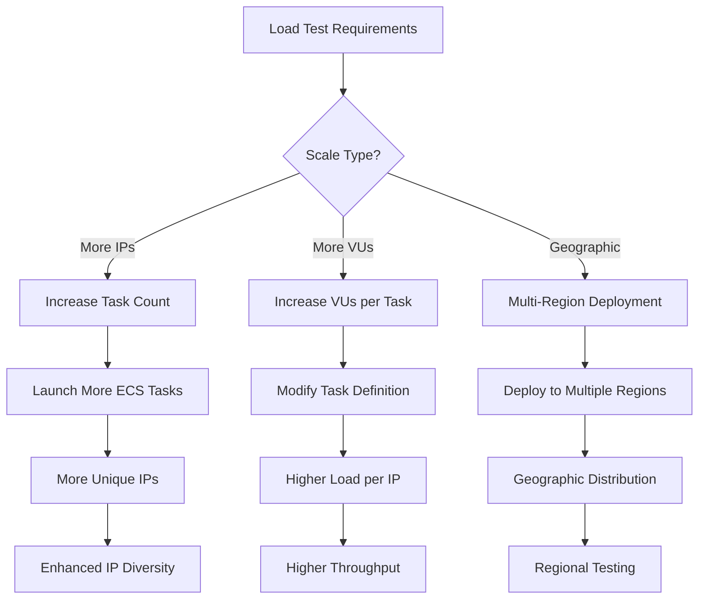
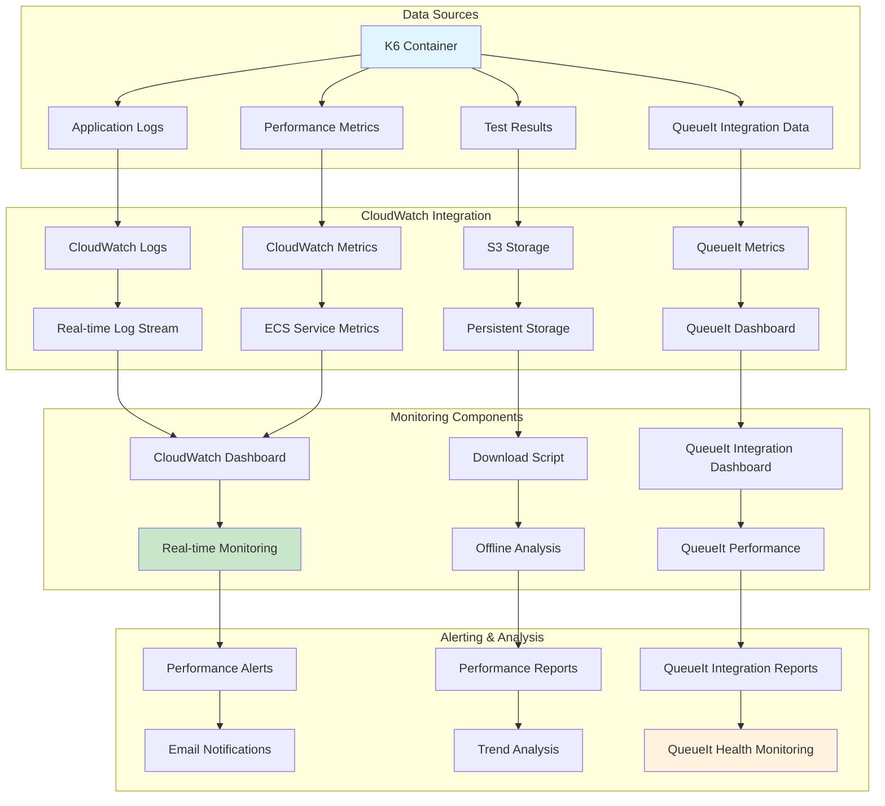
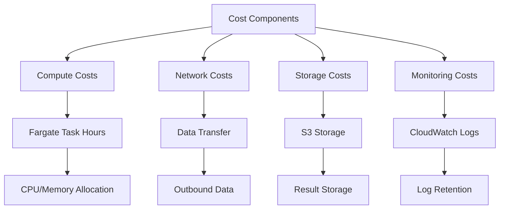

# 🏗️ K6 Load Testing Solution Architecture

## 📋 Table of Contents

1. [Overview](#overview)
2. [System Architecture](#system-architecture)
3. [Component Details](#component-details)
4. [Request Flow Diagrams](#request-flow-diagrams)
5. [IP Diversity Assignment Flow](#ip-diversity-assignment-flow)
6. [Test Execution Flow](#test-execution-flow)
7. [QueueIt Integration Flow](#queueit-integration-flow)
8. [Results Processing Flow](#results-processing-flow)
9. [Data Flow Architecture](#data-flow-architecture)
10. [Security Architecture](#security-architecture)
11. [Scalability Considerations](#scalability-considerations)
12. [Monitoring & Observability](#monitoring--observability)
13. [Cost Optimization](#cost-optimization)

---

## 🎯 Overview

This document provides a comprehensive view of the K6 Load Testing solution architecture with IP diversity and QueueIt integration, detailing how AWS Fargate, ECS, and other components work together to deliver scalable, serverless load testing capabilities.

### **Key Objectives**
- **Serverless Load Testing**: No server management required
- **IP Diversity**: Multiple unique IP addresses for realistic testing
- **QueueIt Integration**: Comprehensive queue management testing
- **Scalable Architecture**: Handle varying load testing requirements
- **Cost Optimization**: Pay only for actual test execution
- **Comprehensive Monitoring**: Real-time metrics and logging

---

## 🏗️ System Architecture

### **High-Level Architecture Diagram**

```
┌─────────────────────────────────────────────────────────────────────────────┐
│                           AWS Cloud Infrastructure                        │
├─────────────────────────────────────────────────────────────────────────────┤
│                                                                             │
│  ┌─────────────────┐    ┌─────────────────┐    ┌─────────────────┐        │
│  │   ECS Cluster   │    │   CloudWatch    │    │   S3 Bucket     │        │
│  │                 │    │                 │    │                 │        │
│  │ ┌─────────────┐ │    │ ┌─────────────┐ │    │ ┌─────────────┐ │        │
│  │ │ Task 1      │ │    │ │   Logs      │ │    │ │ Test Results│ │        │
│  │ │ IP: 3.x.x.1 │ │    │ │   Metrics   │ │    │ │ Logs        │ │        │
│  │ └─────────────┘ │    │ └─────────────┘ │    │ └─────────────┘ │        │
│  │ ┌─────────────┐ │    └─────────────────┘    └─────────────────┘        │
│  │ │ Task 2      │ │                                                       │
│  │ │ IP: 3.x.x.2 │ │                                                       │
│  │ └─────────────┘ │                                                       │
│  │ ┌─────────────┐ │                                                       │
│  │ │ Task 3      │ │                                                       │
│  │ │ IP: 3.x.x.3 │ │                                                       │
│  │ └─────────────┘ │                                                       │
│  │ ┌─────────────┐ │                                                       │
│  │ │ Task 10     │ │                                                       │
│  │ │ IP: 3.x.x.10│ │                                                       │
│  │ └─────────────┘ │                                                       │
│  └─────────────────┘                                                       │
│                                                                             │
│  ┌─────────────────┐    ┌─────────────────┐    ┌─────────────────┐        │
│  │   VPC Network   │    │   IAM Roles     │    │   Terraform     │        │
│  │                 │    │                 │    │                 │        │
│  │ ┌─────────────┐ │    │ ┌─────────────┐ │    │ ┌─────────────┐ │        │
│  │ │ Public      │ │    │ │ Task Role   │ │    │ │ Infrastructure│ │        │
│  │ │ Subnet      │ │    │ │ Execution   │ │    │ │ Management   │ │        │
│  │ │ IGW         │ │    │ │ Role        │ │    │ │              │ │        │
│  │ └─────────────┘ │    │ └─────────────┘ │    │ └─────────────┘ │        │
│  └─────────────────┘    └─────────────────┘    └─────────────────┘        │
│                                                                             │
└─────────────────────────────────────────────────────────────────────────────┘
                                    │
                                    ▼
┌─────────────────────────────────────────────────────────────────────────────┐
│                        Target Application                                 │
│                    https://affluenceit.com/                              │
│                                                                             │
│  ┌─────────────────┐    ┌─────────────────┐    ┌─────────────────┐        │
│  │ QueueIt Filter  │    │ Protected Route │    │ Public Route    │        │
│  │ /owners/new     │    │ /owners/new     │    │ /               │        │
│  │ 302 Redirect    │    │ QueueIt Check   │    │ Direct Access   │        │
│  └─────────────────┘    └─────────────────┘    └─────────────────┘        │
└─────────────────────────────────────────────────────────────────────────────┘
```

---

## 🔧 Component Details

### **1. AWS Fargate (Serverless Compute)**

**Role**: Provides serverless compute capacity for running k6 containers

**Key Characteristics**:
- **No Server Management**: AWS handles underlying infrastructure
- **Pay-per-Task**: Only pay when containers are running
- **Automatic Scaling**: Start/stop based on demand
- **VPC Integration**: Direct network access with public IPs
- **IP Diversity**: Each task gets unique public IP

**Configuration**:
```terraform
resource "aws_ecs_task_definition" "k6_task" {
  family                   = "k6-single-vu-task"
  network_mode             = "awsvpc"
  requires_compatibilities = ["FARGATE"]
  cpu                      = 256
  memory                   = 512
}
```

### **2. ECS (Elastic Container Service)**

**Role**: Orchestrates container execution and management

**Key Functions**:
- **Task Scheduling**: Determines where to run containers
- **Resource Management**: Allocates CPU/memory to tasks
- **Service Discovery**: Enables container communication
- **Health Monitoring**: Tracks container health
- **IP Assignment**: Each task gets unique public IP

### **3. VPC Network Infrastructure**

**Components**:
- **VPC**: Isolated network environment
- **Public Subnet**: Internet-accessible resources with auto-assign public IP
- **Internet Gateway**: Internet connectivity
- **Route Tables**: Traffic routing rules
- **Security Groups**: Network access control

**Network Flow**:
```
ECS Task → Public Subnet → Internet Gateway → Internet → Target Application
```

**Current Configuration**:
```terraform
resource "aws_vpc" "k6_vpc" {
  cidr_block           = "10.0.0.0/16"
  enable_dns_hostnames = true
  enable_dns_support   = true
}

resource "aws_subnet" "k6_public_subnet" {
  vpc_id                  = aws_vpc.k6_vpc.id
  cidr_block              = "10.0.1.0/24"
  availability_zone       = "us-east-1a"
  map_public_ip_on_launch = true  # ← Enables auto-assign
}
```

### **4. S3 Storage**

**Role**: Persistent storage for test results and logs

**Storage Structure**:
```
s3://k6-load-test-results-786407478307/
├── test-results/
│   ├── 20250709-114704/
│   │   ├── results.json              # Detailed k6 metrics
│   │   ├── test-summary.json         # Test metadata
│   │   ├── k6.log                   # Application logs
│   │   └── queueit-analysis.json    # QueueIt integration data
│   └── 20250709-120000/
│       ├── results.json
│       ├── test-summary.json
│       ├── k6.log
│       └── queueit-analysis.json
```

### **5. CloudWatch Monitoring**

**Components**:
- **Logs**: Real-time container logs
- **Metrics**: Performance and resource metrics
- **Dashboard**: Visual monitoring interface
- **Alarms**: Automated alerting

**Current Configuration**:
```terraform
resource "aws_cloudwatch_log_group" "k6_logs" {
  name              = "/ecs/k6-single-vu-task"
  retention_in_days = 7
}
```

---

## 🔄 Request Flow Diagrams

### **1. IP Diversity Assignment Flow**



**Detailed Steps**:

1. **Task Deployment**
   ```bash
   aws ecs run-task \
     --cluster k6-load-test-cluster \
     --task-definition k6-single-vu-task \
     --launch-type FARGATE \
     --network-configuration "awsvpcConfiguration={subnets=[subnet-097cbe067e542243a],securityGroups=[sg-0737d6eb4011e161c],assignPublicIp=ENABLED}" \
     --region us-east-1
   ```

2. **Fargate Resource Allocation**
   - CPU: 256 units (0.25 vCPU)
   - Memory: 512 MiB
   - Network: awsvpc mode

3. **IP Assignment Process**
   - **Private IP**: Assigned from VPC subnet (10.0.1.0/24)
   - **Public IP**: Auto-assigned from AWS public IP pool
   - **Network Interface**: Each task gets dedicated ENI

4. **Network Configuration**
   - **Subnet**: Public subnet with auto-assign public IP
   - **Route Table**: Routes 0.0.0.0/0 to Internet Gateway
   - **Security Group**: Allows all outbound traffic

### **2. Test Execution Flow**



### **3. QueueIt Integration Flow**



---

## 🌐 IP Diversity Assignment Flow

### **Multiple Tasks IP Assignment Flow**



---

## 🎯 QueueIt Integration Flow

### **QueueIt Integration Testing Flow**



---

## 📊 Results Processing Flow

### **Complete Results Processing Flow**

```mermaid
flowchart TD
    subgraph "Test Completion"
        A[K6 Test Finishes] --> B[Generate Results Files]
        B --> C[Test Metrics]
        B --> D[QueueIt Redirect Data]
        B --> E[Performance Data]
    end
    
    subgraph "Local Processing"
        C --> F[Upload Script Triggers]
        D --> F
        E --> F
        F --> G[Enhanced Test: S3 Upload]
        F --> H[Simple Test: CloudWatch Only]
    end
    
    subgraph "S3 Upload Process"
        G --> I[Create S3 Path]
        I --> J[s3://k6-load-test-results-786407478307/test-results/20250709-114704/]
        J --> K[Upload results.json]
        J --> L[Upload test-summary.json]
        J --> M[Upload k6.log]
    end
    
    subgraph "CloudWatch Integration"
        A --> N[Real-time Log Stream]
        N --> O[CloudWatch Logs]
        O --> P[/ecs/k6-single-vu-task]
        
        A --> Q[Performance Metrics]
        Q --> R[ECS Service Metrics]
        R --> S[CPU Utilization]
        R --> T[Memory Utilization]
    end
    
    subgraph "Monitoring & Analysis"
        S --> U[CloudWatch Dashboard]
        T --> U
        P --> U
        
        K --> V[Download Script]
        L --> V
        M --> V
        V --> W[Local Analysis]
        W --> X[Performance Reports]
        W --> Y[QueueIt Integration Analysis]
    end
    
    style A fill:#e1f5fe
    style Y fill:#c8e6c9
```

---

## 🌐 Data Flow Architecture

### **Complete Data Flow**

```mermaid
flowchart TD
    subgraph "Data Generation"
        A[K6 Test Execution] --> B[Generate Metrics]
        A --> C[Generate Logs]
        A --> D[Generate Results]
        A --> E[QueueIt Integration Data]
    end
    
    subgraph "Local Storage"
        B --> F[/results/results.json]
        C --> G[/results/k6.log]
        D --> H[/results/test-summary.json]
        E --> I[/results/queueit-analysis.json]
    end
    
    subgraph "S3 Storage"
        F --> J[S3 Upload Script]
        G --> J
        H --> J
        I --> J
        J --> K[S3 Bucket]
        K --> L[Organized Structure]
        L --> M[s3://k6-load-test-results-786407478307/test-results/20250709-114704/]
    end
    
    subgraph "CloudWatch Storage"
        A --> N[Real-time Log Stream]
        N --> O[CloudWatch Logs]
        O --> P[/ecs/k6-single-vu-task]
        
        A --> Q[Performance Metrics]
        Q --> R[CloudWatch Metrics]
        R --> S[ECS Service Metrics]
    end
    
    subgraph "Data Access"
        M --> T[Download Script]
        T --> U[Local Analysis]
        U --> V[Performance Reports]
        U --> W[QueueIt Integration Reports]
        
        P --> X[CloudWatch Dashboard]
        S --> X
    end
    
    style A fill:#e1f5fe
    style W fill:#c8e6c9
    style X fill:#fff3e0
```

---

## 🔒 Security Architecture

### **Security Components**



### **Security Best Practices**

1. **Network Security**
   - VPC isolation for all resources
   - Security groups with minimal required access
   - Public subnets only for outbound internet access

2. **IAM Security**
   - Least privilege principle for all roles
   - Task execution role for ECS
   - Task role for application permissions

3. **Data Security**
   - S3 bucket encryption at rest
   - CloudWatch logs encryption
   - Secure credential management

4. **Monitoring Security**
   - Comprehensive logging
   - Access monitoring
   - Security event alerting

---

## 📈 Scalability Considerations

### **Horizontal Scaling**



### **Scaling Strategies**

1. **IP Diversity Scaling**
   - Increase number of ECS tasks
   - Each task provides unique IP
   - Natural scaling with AWS infrastructure

2. **Load Scaling**
   - Increase VUs per task
   - Modify task CPU/memory allocation
   - Optimize for specific load patterns

3. **Geographic Scaling**
   - Multi-region deployment
   - Regional IP diversity
   - Geographic performance testing

4. **Cost Optimization**
   - Right-size task resources
   - Optimize test duration
   - Use spot instances for non-critical tests

---

## 📊 Monitoring & Observability

### **Monitoring Architecture**



### **Key Metrics**

1. **Performance Metrics**
   - CPU and memory utilization
   - Network throughput
   - Response times
   - Error rates

2. **QueueIt Integration Metrics**
   - 302 redirect rates
   - Health check status
   - Queue entry success rates
   - Integration error rates

3. **IP Diversity Metrics**
   - Unique IP count
   - IP distribution
   - Geographic distribution
   - IP rotation success

4. **Business Metrics**
   - Test completion rates
   - Queue management effectiveness
   - User experience simulation
   - Load balancer performance

---

## 💰 Cost Optimization

### **Cost Structure**



### **Cost Optimization Strategies**

1. **Compute Optimization**
   - Right-size task resources (256 CPU, 512 MB memory)
   - Optimize test duration
   - Use spot instances for non-critical tests

2. **Network Optimization**
   - Minimize data transfer
   - Optimize test frequency
   - Use efficient protocols

3. **Storage Optimization**
   - Implement log retention policies
   - Compress result files
   - Clean up old test results

4. **Monitoring Optimization**
   - Configure appropriate log retention
   - Use sampling for high-volume logs
   - Optimize metric collection

### **Cost Estimation**

| Component | **Cost Factor** | **Estimated Cost** |
|-----------|----------------|-------------------|
| **Fargate Tasks** | $0.04048 per vCPU per hour | $0.01 per task hour |
| **Memory** | $0.004445 per GB per hour | $0.002 per task hour |
| **S3 Storage** | $0.023 per GB per month | $0.01 per test |
| **CloudWatch Logs** | $0.50 per GB ingested | $0.05 per test |
| **Data Transfer** | $0.09 per GB | $0.01 per test |

**Total Estimated Cost**: ~$0.15 per test run (10 tasks, 1 hour)

---

## 🎯 Summary

### **Architecture Benefits**

1. **Serverless Design**
   - No server management required
   - Automatic scaling and resource allocation
   - Pay-per-use pricing model

2. **IP Diversity**
   - Natural IP diversity through multiple tasks
   - Each task gets unique AWS public IP
   - Excellent for QueueIt integration testing

3. **QueueIt Integration**
   - Comprehensive queue management testing
   - Independent user sessions per IP
   - Realistic user behavior simulation

4. **Scalability**
   - Horizontal scaling through task multiplication
   - Vertical scaling through resource allocation
   - Geographic scaling through multi-region deployment

5. **Monitoring**
   - Real-time metrics and logging
   - Comprehensive dashboard integration
   - Automated alerting and reporting

### **Key Components**

- **ECS Fargate**: Serverless compute for k6 containers
- **VPC Network**: Isolated network with public IP assignment
- **S3 Storage**: Persistent storage for test results
- **CloudWatch**: Real-time monitoring and logging
- **QueueIt Integration**: Queue management testing capabilities

### **Future Enhancements**

1. **Advanced IP Rotation**
   - Container-level IP rotation
   - Proxy-based IP diversity
   - Geographic IP distribution

2. **Enhanced Monitoring**
   - Advanced dashboards
   - Machine learning insights
   - Predictive analytics

3. **Integration Capabilities**
   - CI/CD pipeline integration
   - API-based test execution
   - Multi-cloud support

This architecture provides a robust, scalable, and cost-effective solution for load testing with IP diversity and QueueIt integration! 🚀 